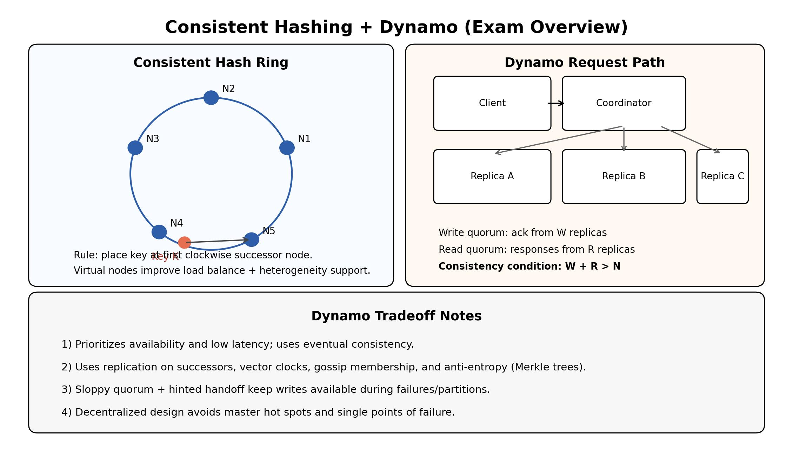

# Lecture 10 Summary: Consistent Hashing and Dynamo

## 1. Big Picture
This lecture covers two core ideas for cloud-scale storage systems:
1. **Consistent hashing** for scalable data partitioning and re-partitioning
2. **Amazon Dynamo** design for high availability, low latency, and eventual consistency

## 2. Why This Matters
| Problem | Why it is hard at cloud scale |
|---|---|
| Horizontal scaling | Large clusters face constant component failures |
| Data placement | Need balanced key-to-node mapping |
| Node churn | Nodes join/leave/fail; mapping must adapt efficiently |
| Availability vs consistency | Partitions/failures force tradeoffs |

## 3. Hashing for Partitioning
### 3.1 Modulo hashing (baseline)
Mapping: `node = hash(key) mod k`

Issue:
- If `k` changes (node join/failure), many keys remap globally.
- Causes large data movement and instability.

### 3.2 Consistent hashing (improvement)
- Map both nodes and keys to a ring over ID space `0 .. 2^m - 1`.
- Store each key at its first clockwise successor node.

Benefits:
- **Smoothness**: only a localized subset of keys moves on node changes.
- Better incremental scaling than modulo hashing.

## 4. Consistent Hashing Details
| Concept | Meaning |
|---|---|
| Ring | Circular hash space |
| Successor(key) | First node clockwise from key hash |
| Balance goal | No node gets too many keys (in expectation) |
| Smoothness goal | Join/leave affects minimal unrelated keys |

### 4.1 Virtual nodes (vnodes)
- Each physical node owns multiple token positions.
- Improves load balance and supports heterogeneity.
- On failure, ownership transfer spreads across many physical nodes.

## 5. Key-Value Store Perspective
Interface:
- `put(key, value)`
- `get(key)`

Typical examples:
- E-commerce user/session/product data
- Social user profile/state data
- Distributed file/block metadata

Core challenges:
- Fault tolerance
- Scalability
- Consistency semantics
- Latency predictability

## 6. Directory-Based vs Decentralized Lookup
| Approach | Advantages | Disadvantages |
|---|---|---|
| Central directory/master | Simple mapping, easier serialization/consistency control | Bottleneck + single point of failure risk |
| Decentralized ring lookup | Scalable, no central hotspot, fault-resilient | More complex routing/stabilization logic |

## 7. Quorum-Based Replication (High-Yield)
Let:
- `N` = replication factor (replicas per key)
- `W` = write quorum (acks needed)
- `R` = read quorum (responses needed)

Key condition for overlap:

`W + R > N`

Interpretation:
- Read and write quorums intersect at least one replica, improving read freshness probability.

Example from lecture style:
- `N=3, W=2, R=2` satisfies overlap.

## 8. Consistency Challenges in Replicated Systems
| Scenario | Risk |
|---|---|
| Concurrent writes to same key | Different replicas may apply in different orders |
| Read after write | Reader may hit replica not yet updated |
| Slow/failed replicas | Tradeoff between waiting and latency/availability |

Consistency models mentioned:
- Strong/atomic consistency (linearizable behavior)
- Eventual consistency
- Other models (causal, sequential, etc.)

## 9. Dynamo Design Philosophy
Dynamo prioritizes:
- **Availability + low latency** under failures
- **Eventual consistency** over strict immediate consistency
- **Symmetry and decentralization** (avoid central bottlenecks)
- **Incremental scalability + heterogeneity support**

## 10. Dynamo Techniques (Exam Table)
| Problem | Dynamo technique | Benefit |
|---|---|---|
| Partitioning | Consistent hashing | Incremental scaling |
| Version conflicts | Vector clocks + reconciliation (often at read) | Supports always-writable behavior |
| Temporary replica failures | Sloppy quorum + hinted handoff | High availability/durability under partial failures |
| Replica divergence | Anti-entropy using Merkle trees | Efficient background synchronization |
| Membership/failure detection | Gossip protocol | Decentralized liveness and membership updates |

## 11. Dynamo Interface and Semantics
- `get(key) -> value(s), context`
- `put(key, context, value) -> OK`

Notes:
- `get` may return multiple conflicting versions.
- `context` carries version metadata (for causality/merge handling).
- “Always writeable” emphasis shifts conflict resolution to later stages (often read path/application logic).

## 12. Lookup and Stabilization in Ring-Based Systems
Decentralized lookup service goals:
- Each node stores routing info about only `O(log M)` nodes (M = total nodes).
- Route lookup in `O(log M)` hops.

Stabilization ideas:
- Periodic `stabilize()` and `notify()` maintain successor/predecessor correctness after joins/leaves.
- Maintain multiple successors (`k > 1`) for robustness.

## 13. Failure Handling Summary
| Failure type | Typical handling |
|---|---|
| Node/disk failure | Replication on successor nodes + re-replication |
| Temporary partition | Continue operation with eventual consistency strategy |
| Slow nodes | Quorum-based completion and asynchronous repair |
| Membership changes | Gossip + stabilization to update ring routing |

## 14. Tradeoff Summary (Availability vs Consistency)
When partitions occur:
- Strict consistency often requires blocking some operations.
- High availability allows operations to continue, but stale/conflicting versions may appear.

Dynamo chooses:
- Fast, highly available operations
- Eventual convergence via background + application-assisted reconciliation

## 15. Formula and Concept Sheet
| Item | Expression / Rule |
|---|---|
| Datacenter failure likelihood over period | `1 - (1 - p)^n` |
| Quorum overlap condition | `W + R > N` |
| Consistent hashing placement | key -> first clockwise successor |
| Routing complexity target (ring overlays) | `O(log M)` state and lookup hops |

## 16. Must-Memorize Points
1. Modulo hashing remaps too much when cluster size changes; consistent hashing minimizes remapping.
2. Virtual nodes are critical for load balance and heterogeneous capacity.
3. Dynamo is designed for availability and low latency first, with eventual consistency.
4. Quorum reads/writes use `N, W, R` and overlap condition `W + R > N`.
5. Vector clocks track version causality; conflicts are expected and reconciled.
6. Gossip, hinted handoff, and Merkle-tree anti-entropy are core Dynamo reliability mechanisms.
7. Decentralized design avoids central bottlenecks and supports incremental scale.
