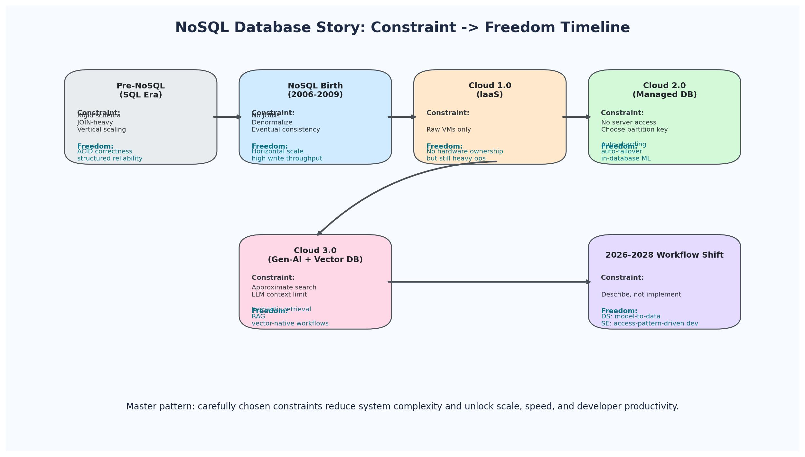

# Lecture 11 Summary: NoSQL Database Story

## 1. One-Line Thesis
NoSQL started as a response to web-scale limits of relational databases, evolved through managed cloud services, and now powers Gen-AI workflows (especially vector retrieval), with the recurring design pattern: **carefully chosen constraints create new freedom**.

## 2. Why NoSQL Was Born
### Breaking point (mid-2000s web scale)
| Pressure | What changed on the internet | Why classic SQL struggled |
|---|---|---|
| Volume | Billions of users, massive clickstreams | Vertical scaling hits hardware/cost limits |
| Velocity | Very high write rates | Strong coordination and locking become expensive |
| Variety | Logs, text, sessions, nested JSON | Rigid schemas and many JOINs create friction |

### Key historical milestones
| Year/period | Event | Significance |
|---|---|---|
| 2006-2009 | Bigtable, Dynamo papers | New distributed data models for scale |
| Late 2000s onward | MongoDB, Cassandra, HBase | Practical NoSQL ecosystems |
| 2010s | Managed NoSQL in cloud | NoSQL became mainstream in production |

## 3. Core Idea: Constraint That Deconstrains
| Constraint | What you give up | What you gain |
|---|---|---|
| No JOINs at distributed scale | Rich ad-hoc relational joins | Horizontal scale and predictable distributed performance |
| Eventual consistency | Immediate global consistency after write | High availability and very high write throughput |
| Denormalization | Perfect normalization/no redundancy | Fast single-query reads for app-centric access patterns |

Exam framing: distributed systems often reject globally expensive operations (for example cross-shard joins) to gain scale and resilience.

## 4. REST + JSON + NoSQL: Impedance Matching
### Structural mismatch (SQL era web apps)
| Layer | Native data shape |
|---|---|
| REST APIs | Nested JSON objects/arrays |
| SQL DBs | Normalized rows/tables |

### Translation overhead in SQL pipelines
1. Unpack JSON.
2. Normalize into multiple tables.
3. Reconstruct with JOINs for API responses.

### Document-store alignment
| Incoming API payload | Document DB storage | SQL equivalent effort |
|---|---|---|
| Nested JSON object | Store almost directly as a document | Multiple tables + foreign keys + JOIN-based reconstruction |

Takeaway: document databases reduce object-relational translation friction for JSON-native systems.

## 5. Cloud Eras and NoSQL Evolution
## 5.1 Cloud 1.0 (IaaS: EC2/S3 era)
| Characteristics | Impact on teams |
|---|---|
| Run databases on VMs | Less hardware ownership, but heavy operational burden remains |
| Self-managed clustering/failover/backups | High ops complexity for distributed NoSQL |

Data scientist impact: major time spent exporting/reshaping data before modeling.

Software engineer impact: manual sharding, failover handling, and custom KV scaling logic.

## 5.2 Cloud 2.0 (Managed services)
| Representative services | Key capability |
|---|---|
| DynamoDB | Managed key-value at scale |
| MongoDB Atlas | Managed document store |
| Cosmos DB | Global distribution + multi-model patterns |
| Firestore | Managed document workflows |

### Cloud 2.0 constraints and freedom
| Constraint | Freedom unlocked |
|---|---|
| No direct server access | No patching/backups/failover operations burden |
| Must design partition key | Automatic large-scale sharding/throughput |
| Pay per request | Elastic usage, can scale down cost when idle |

## 5.3 Cloud 3.0 (Gen-AI era)
| New primitive | What changed |
|---|---|
| Vector databases | Semantic similarity retrieval became first-class |
| LLM-assisted querying | Natural language to query/code generation |
| Retrieval-Augmented Generation (RAG) | Systematic handling of LLM context limits |

## 6. Vector Search and LLM Constraints
### Approximate nearest neighbor (ANN)
| Constraint | Tradeoff |
|---|---|
| Approximate, not exact nearest neighbors | Slight accuracy loss for huge latency/scale gains |

Practical outcome: billion-scale similarity search can run in interactive latency windows.

### LLM context-window constraint
| Constraint | Engineering response | Benefit |
|---|---|---|
| Cannot send entire corpus in one prompt | Retrieve top relevant chunks (RAG) | Lower cost, better grounding, production feasibility |

## 7. Impact on Data Scientists
### Then vs now trajectory
| Workflow dimension | Earlier workflow | Emerging workflow |
|---|---|---|
| Feature creation | Manual feature engineering code | Intent/description-driven feature generation |
| Model training location | Export to external notebooks/processes | In-database training pipelines |
| Text representation | TF-IDF/bag-of-words heavy | LLM embeddings + tabular features |
| Ops overhead | Data movement dominates | Model-to-data pattern reduces movement |

### High-yield modeling pattern
Text + structured data pipeline:
1. Generate embedding for unstructured text.
2. Store embedding in vector-capable data layer.
3. Concatenate embedding features with structured attributes.
4. Train model (often gradient boosting) on combined feature space.

## 8. Impact on Software Engineers
### Workflow shift
| Old focus | New focus |
|---|---|
| Choosing low-level structures and writing boilerplate CRUD | Describing access patterns and service-level intent |
| Manual sharding/cache eviction tuning | Managed/autonomous data platform behavior |
| Exact-match cache only | Semantic cache using vector similarity |

### Vector KV as a new primitive
| Traditional KV | Vector KV |
|---|---|
| Query by exact key | Query by semantic similarity |
| O(1) exact hash lookup | ANN-based nearest-neighbor retrieval |
| Best for exact identity lookup | Best for meaning-based retrieval and semantic cache |

## 9. Unified Era Comparison (Exam Table)
| Era | Core technology | Data scientist impact | Software engineer impact | Constraint -> freedom |
|---|---|---|---|---|
| Pre-NoSQL | SQL on-prem | Heavy ETL, flat-table bias | In-memory-only KV + manual scaling | ACID discipline -> correctness |
| NoSQL birth | Document/KV/wide-column | Better nested data storage, still export-heavy ML | Distributed stores appear but ops-heavy | No JOINs -> horizontal scaling |
| Cloud 1.0 | IaaS VMs | VM-based pipelines, limited in-db ML | Self-managed clustering/failover | Raw VMs -> no hardware ownership |
| Cloud 2.0 | Managed NoSQL/PaaS | In-database ML, less movement | Auto-scaling managed KV/document DB | No server access -> lower ops burden |
| Cloud 3.0 | Vector DB + LLM-native stack | Embedding-first and intent-driven workflows | Semantic cache + generated data access code | Approximate search/context limits -> practical AI scale |

## 10. Exam-Ready Definitions
| Term | Concise definition |
|---|---|
| Impedance mismatch | Structural friction between data shapes across system layers (for example JSON vs normalized tables) |
| Denormalization | Intentionally storing repeated/embedded data to optimize read/write access patterns |
| Eventual consistency | Replicas converge over time; immediate global consistency is not guaranteed |
| ANN search | Approximate nearest-neighbor retrieval for high-dimensional vectors |
| RAG | Retrieve relevant context first, then generate response with LLM |
| Semantic cache | Cache hit based on meaning similarity rather than exact string match |

## 11. Likely Exam Discussion Prompts
1. Explain why "no JOINs" can be a strength in web-scale distributed systems.
2. Compare Cloud 1.0 vs Cloud 2.0 for operational responsibility and developer productivity.
3. Describe how vector databases and RAG address LLM production constraints.
4. Contrast exact-match KV caching with vector/semantic caching.
5. Argue how "constraint that deconstrains" appears across NoSQL, REST, managed cloud, and Gen-AI systems.

## 12. Must-Memorize Points
1. NoSQL emerged due to volume, velocity, and variety pressures that exceeded comfortable SQL scaling patterns.
2. The central pattern is not "remove all constraints" but "choose constraints that unlock system-level freedom".
3. Document stores align naturally with JSON-first API ecosystems, reducing translation overhead.
4. Managed services changed engineering economics by shifting effort from operations to product logic.
5. In Gen-AI systems, vector retrieval and RAG are foundational because exact search and full-context prompting do not scale well.
6. Data science is shifting from data movement to in-database and embedding-native workflows.
7. Software engineering is shifting from implementing data structures to specifying access patterns and service intent.

## 13. Final Takeaway
NoSQL is best understood as an architectural evolution: from schema rigidity and centralized assumptions toward distributed, API-aligned, AI-native data systems, where each era advances by imposing the right constraints to enable greater scalability, resilience, and development speed.
