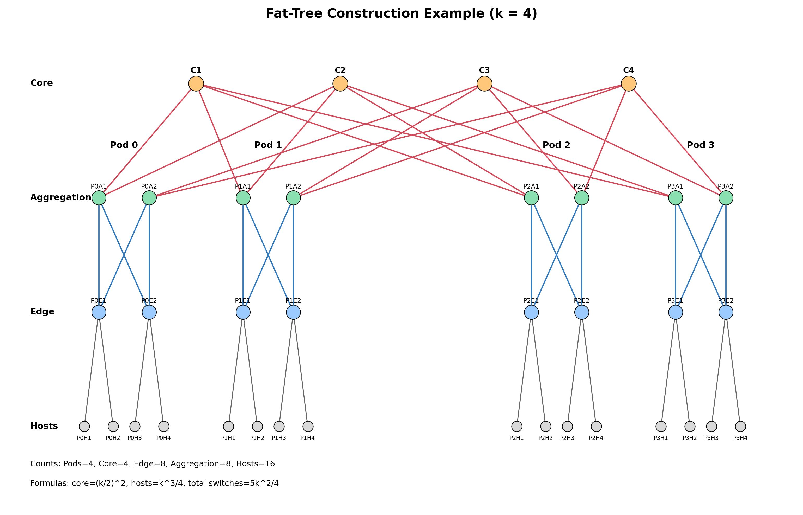

# Lecture 2 Summary: Data Center Networking

## 1. Big Picture
This lecture connects classic networking fundamentals to modern data center network design.

Core storyline:
1. Internet basics (switching, addressing, routing, performance, layering)
2. Transport behavior (TCP reliability, flow control, congestion control)
3. Why data center topologies evolved from hierarchical designs to Clos/fat-tree
4. Traffic patterns and congestion issues in production DCs
5. DCTCP as a practical congestion-control improvement for DC workloads

## 2. Networking Fundamentals (Exam Table)
| Topic | Key Idea | Exam Tip |
|---|---|---|
| Nodes and links | Nodes include hosts, switches, routers; links can be wired/wireless, point-to-point/shared | Be able to identify forwarding elements vs endpoints |
| Circuit switching | Dedicated path after setup | Predictable but inefficient for bursty traffic |
| Packet switching | Data split into packets over shared links | Better statistical multiplexing; can queue/drop |
| Addressing | Unicast, broadcast, multicast | Know destination granularity of each |
| Routing | Forward packet based on destination address | Router checks local network vs next hop |
| Multiplexing | TDM/FDM and statistical multiplexing | Statistical multiplexing gives gain when users are bursty |

## 3. Performance Metrics
| Metric | Definition | Simple Formula |
|---|---|---|
| Bandwidth / Throughput | Data rate over link/path | 1 MBps = 8 Mbps |
| Propagation delay | Signal travel time | distance / c |
| Transmission delay | Time to push bits onto link | packet_size / link_bandwidth |
| Queueing delay | Waiting time in buffers | rises sharply near congestion |
| End-to-end latency | Total path delay | propagation + transmission + queueing |

### Interpretation for workload size
| Workload Type | Dominant Concern |
|---|---|
| Very short/small flows | Queueing and latency |
| Large flows | Throughput (transmission time) |

## 4. Layering and TCP/IP
| Layer | Main Responsibility | Example |
|---|---|---|
| Application | App-specific protocols/data | HTTP, email |
| Transport | End-to-end delivery semantics | TCP, UDP |
| Network | Internetwork routing/addressing | IP |
| Link (MAC) | Local-link access | Ethernet, 802.11 |
| Physical | Bit representation on medium | Fiber, DSL, Bluetooth |

Why layering matters:
- Separation of concerns
- Interoperability across heterogeneous technologies
- Replace one layer implementation without redesigning all layers

## 5. IP and Routing Essentials
| Item | Notes |
|---|---|
| IP service model | Connectionless, best-effort, no delivery guarantees |
| Typical impairments | Loss, delay, reordering |
| Router behavior | If destination network is directly connected, deliver locally; else forward to next hop |

## 6. TCP Essentials for Data Centers
| Feature | Purpose | Mechanism |
|---|---|---|
| Reliability | In-order correct delivery | Sequence numbers + ACKs + retransmission |
| Flow control | Protect receiver buffers | Receiver window (`rwnd`) |
| Congestion control | Protect network from overload | Congestion window (`cwnd`) + loss/ECN signals |

### AIMD behavior (classical TCP)
| Phase | Rule |
|---|---|
| Additive increase | Increase `cwnd` gradually while no congestion detected |
| Multiplicative decrease | On congestion signal, reduce `cwnd` significantly (often by half) |

### AIMD formulas (exam-focused)
Let `W` be congestion window in MSS units.

| Case | Formula | Notes |
|---|---|---|
| Additive increase (per RTT) | `W_{t+1} = W_t + alpha` | Classical TCP Reno congestion avoidance uses `alpha = 1` MSS/RTT |
| Multiplicative decrease (on congestion event) | `W <- beta W` | Classical Reno often uses `beta = 1/2` |
| Sawtooth average window | `W_avg approximately (W_max + W_max/2)/2 = 3W_max/4` | For `beta = 1/2` |

Generalized AIMD (often seen in tutorials):
- Flow `i`: `W_i(k+1) = beta_i W_i(k) + (alpha_i / sum_j alpha_j) * sum_j ((1-beta_j)W_j(k))`
- Steady-state fairness direction: `W_i* proportional alpha_i / (1-beta_i)`
- If all flows use `alpha_i = 1, beta_i = 1/2`, then fair equilibrium is equal windows.

Worked mini example:
- Start `W = 10` MSS, `alpha = 1`, `beta = 1/2`
- After 3 RTTs without congestion: `W = 13`
- Congestion occurs: `W <- 13/2 = 6.5` MSS (implementation rounds by stack rules)

Important caveat from lecture:
- Packet drops/duplicate ACKs are imperfect congestion signals in some environments (e.g., wireless/path changes).

## 7. Data Center Topology Evolution
The lecture uses Google network evolution to show why old designs stopped scaling.

| Era / Design | Characteristics | Limitation / Motivation to Change |
|---|---|---|
| Traditional hierarchical / four-post (early) | Cluster routers + ToR hierarchy | Expensive high-radix devices, oversubscription, limited per-host bandwidth growth |
| Firehose generations | Early Close-style scale-out with commodity components | Operational complexity and resilience challenges |
| Watchtower / Saturn / Jupiter | Larger Close fabrics, higher bisection bandwidth, centralized control refinements | Need better manageability, fault handling, and massive scale |

Key design principles repeatedly emphasized:
- Close topologies for scalability + path diversity
- Merchant silicon (commodity switch chips) for cost-effective upgrades
- Centralized control view to manage complexity in large fabrics

## 8. Close and Fat-Tree (High-Yield Exam Section)

### 8.1 Why Clos/fat-tree?
| Problem in traditional tree | Clos/fat-tree advantage |
|---|---|
| Expensive core switches with scale-up model | Scale-out using many commodity switches |
| Oversubscription bottlenecks | More equal-cost paths and higher bisection options |
| Poor fault tolerance | Redundancy and multipath diversity |

### 8.2 Fat-tree formulas (k-port switch)
| Quantity | Formula |
|---|---|
| Number of pods | `k` |
| Core switches | `(k/2)^2` |
| Hosts per edge switch | `k/2` |
| Total supported hosts | `k^3/4` |
| Approx. total switches | `5k^2/4` |

Derivation details (for exam proofs):
- Assume `k` is even and every switch has `k` ports.
- Per pod:
	- Edge switches = `k/2`
	- Aggregation switches = `k/2`
	- Hosts per edge = `k/2`
	- Hosts per pod = `(k/2) * (k/2) = k^2/4`
- Total hosts across `k` pods:
	- `N_hosts = k * (k^2/4) = k^3/4`
- Core switches:
	- `N_core = (k/2)^2 = k^2/4`
- Total switches:
	- Pod switches = `k * (k/2 + k/2) = k^2`
	- `N_total = k^2 + k^2/4 = 5k^2/4`

Useful link-count formulas:
- Edge-aggregation links per pod: `(k/2)*(k/2) = k^2/4`
- Total edge-aggregation links: `k * (k^2/4) = k^3/4`
- Total aggregation-core links: also `k^3/4`

Example cited in lecture context:
- 48-port 1GigE fat-tree can scale to around 27,648 hosts using around 2,880 switches.

Worked example (`k = 8`):
- Pods = `8`
- Edge per pod = `4`, Aggregation per pod = `4`
- Hosts per edge = `4`
- Hosts per pod = `4*4 = 16`
- Total hosts = `8*16 = 128` (matches `k^3/4 = 8^3/4 = 128`)
- Core switches = `(8/2)^2 = 16`
- Total switches = `5*8^2/4 = 80`

### 8.3 Non-blocking concept
| Term | Meaning |
|---|---|
| Rearrangeably non-blocking | For any traffic matrix, there exists some path assignment that can realize full available host bandwidth |
| Practical implication | Better support for dynamic east-west DC traffic than simple hierarchical trees |

### 8.4 How to construct a k-port fat-tree (illustrative)

Construction recipe:
1. Choose even `k`.
2. Create `k` pods.
3. In each pod, place `k/2` edge and `k/2` aggregation switches.
4. Connect each edge switch to all aggregation switches in the same pod.
5. Connect each edge switch's remaining `k/2` ports to hosts.
6. Create `(k/2)^2` core switches, arranged as `k/2` groups of `k/2`.
7. Connect each aggregation switch to one core switch in each core group (so each aggregation has `k/2` uplinks).

Small construction example (`k = 4`):
- Pods: 4
- Per pod: 2 edge + 2 aggregation
- Core: `(4/2)^2 = 4`
- Hosts per edge: `2`, total hosts `= 4^3/4 = 16`
- Wiring intuition:
	- Inside each pod: full bipartite connection between 2 edge and 2 aggregation switches.
	- Across pods: each aggregation switch uses 2 uplinks, each to a different core group.
	- Each core switch has one downlink into each pod.

Exam check rule:
- If your constructed topology does not satisfy `hosts = k^3/4` and `core = (k/2)^2`, re-check pod and core-group wiring.

## 9. Traffic Characteristics in Data Centers
| Observation | Why It Matters |
|---|---|
| Mice vs elephant flows | Many small flows; few large flows carry most bytes |
| Locality differs by workload | Some services are highly distributed across racks/pods |
| Edge/core utilization is uneven | A single uniform topology may overprovision some regions and congest others |

Exam takeaway:
- Flow-aware load balancing and congestion management are essential; treating all flows equally is inefficient.

## 10. DCTCP (Data Center TCP)
DCTCP is introduced to handle the DC tension between:
- Low latency for short/query traffic
- High throughput for large/background traffic
- Tolerance to bursty incast behavior

### DCTCP vs classical TCP (conceptual)
| Aspect | Classical TCP | DCTCP |
|---|---|---|
| Main congestion signal | Loss/dupACK (coarse) | ECN marking extent (finer-grained) |
| Window adjustment | More binary/coarse reaction | Proportional response to congestion level |
| Queue objective | Can allow larger queue oscillations | Keep queue occupancy lower while maintaining throughput |
| Best-fit environment | General Internet baseline | Controlled data center fabrics with ECN support |

## 11. Incast and Queue Buildup
| Phenomenon | Description | Effect |
|---|---|---|
| Incast | Many senders transmit to one receiver simultaneously | Sudden queue buildup, drops, latency spikes |
| Buffer tradeoff | Deep buffers absorb bursts but raise latency; shallow buffers reduce latency but reduce burst tolerance | Motivates ECN/DCTCP-style control |

## 12. Quick Comparison Sheet (For Revision)
| Dimension | Traditional Hierarchical DCN | Clos/Fat-tree DCN |
|---|---|---|
| Scaling strategy | Scale-up (bigger core boxes) | Scale-out (many commodity switches) |
| Cost profile | High-end hardware heavy | Better cost/performance via merchant silicon |
| Path diversity | Lower | Higher (multipath) |
| Fault tolerance | Lower graceful degradation | Better redundancy |
| Management complexity | Simpler topology, less flexible | Higher complexity; often needs stronger control plane |

## 13. Must-Memorize Points
1. End-to-end latency is the sum of propagation, transmission, and queueing delays.
2. IP is best-effort; TCP adds reliability and congestion/flow control.
3. AIMD: increase gradually, decrease sharply on congestion.
4. Clos/fat-tree solves scale and bandwidth limits of classic hierarchical DCNs.
5. Fat-tree with k-port switches supports `k^3/4` hosts.
6. Data center traffic has many mice flows and fewer elephant flows; engineering must handle both.
7. DCTCP uses ECN feedback to maintain low queues and high throughput in data centers.
