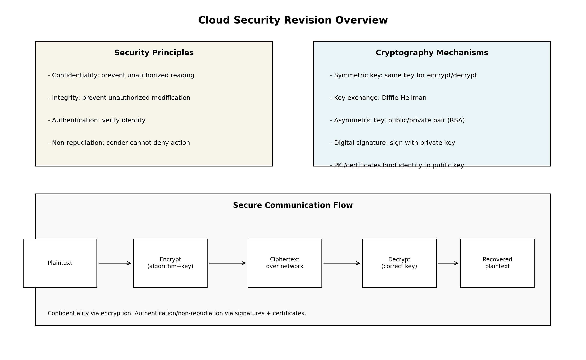

# Lecture 6A Summary: Cloud Security

## 1. Big Picture
This lecture introduces core security goals and the cryptographic tools used to secure communication in cloud environments.

Main thread:
1. Security principles
2. Plaintext vs ciphertext
3. Encryption/decryption basics
4. Symmetric key cryptography
5. Asymmetric key cryptography
6. Digital signatures and PKI

## 2. Security Principles (High-Yield)
| Principle | Meaning | Typical Threat if Missing |
|---|---|---|
| Confidentiality | Only authorized parties can read data | Eavesdropping/data leakage |
| Integrity | Data cannot be altered undetected | Tampering/modification attacks |
| Authentication | Verify identity of communicating party | Impersonation/spoofing |
| Non-repudiation | Sender cannot deny performed action | Denial of sending/signing transactions |

## 3. Plaintext, Ciphertext, and Core Terms
| Term | Definition |
|---|---|
| Plaintext | Human-readable original message |
| Ciphertext | Encoded message not readable without proper key |
| Encryption | Plaintext -> ciphertext |
| Decryption | Ciphertext -> plaintext |
| Cryptography | Methods for secure transformation of information |
| Brute-force attack | Trying all candidate keys/possibilities |

Important design idea:
- Security relies on key secrecy, not algorithm secrecy.

## 4. Classical Cipher Concepts
| Method | Idea | Example from lecture |
|---|---|---|
| Substitution | Replace symbols/letters by rule | Caesar cipher shifts letters |
| Transposition | Rearrange positions/order of symbols | Rail fence style permutation |
| Polygram substitution | Map character blocks to other blocks | Block-level replacement |

Exam insight:
- Small key space (e.g., Caesar shift) is weak against brute force.

## 5. Symmetric Key Cryptography
| Property | Description |
|---|---|
| Keys used | Same key for encryption and decryption |
| Main challenge | Securely sharing the secret key over insecure channel |
| Typical use | Fast bulk-data encryption |

### 5.1 Diffie-Hellman Key Exchange (for key agreement)
Public parameters: prime `p`, generator `g`.
- Alice picks secret `a`, sends `A = g^a mod p`
- Bob picks secret `b`, sends `B = g^b mod p`
- Alice computes `s = B^a mod p`
- Bob computes `s = A^b mod p`
- Both get same shared secret: `s = g^(ab) mod p`

Security intuition:
- Attacker sees `p, g, A, B`, but recovering `a` or `b` is hard for large parameters (discrete log hardness).

### 5.2 DES (historical block cipher)
| Item | Value |
|---|---|
| Block size | 64 bits |
| Effective key size | 56 bits |
| Structure | Multi-round block cipher |

## 6. Asymmetric (Public-Key) Cryptography
| Property | Description |
|---|---|
| Keys used | Public key (encrypt/verify), private key (decrypt/sign) |
| Benefit | Avoids pre-shared secret requirement |
| Requirement | Hard to derive private key from public key |

## 7. RSA (Lecture Focus)
RSA relies on difficulty of factoring a large composite number `N = P*Q`.

### 7.1 Key Generation (as presented)
1. Choose primes `P, Q`
2. Compute `N = P*Q`
3. Compute `phi(N) = (P-1)(Q-1)`
4. Choose public exponent `E` with `gcd(E, phi(N)) = 1`
5. Choose private exponent `D` such that:

`(D*E) mod phi(N) = 1`

### 7.2 RSA En/Decryption Equations
| Operation | Formula |
|---|---|
| Encryption | `CT = PT^E mod N` |
| Decryption | `PT = CT^D mod N` |

## 8. Digital Signatures and Non-Repudiation
To prove origin/ownership of a message:
- Sender signs using private key.
- Receiver verifies using sender's public key.

| Security goal supported | How signature helps |
|---|---|
| Authentication | Proves message came from key owner |
| Integrity | Signature check fails if message changed |
| Non-repudiation | Sender cannot plausibly deny signature |

## 9. Digital Certificates and PKI
Problem:
- How do we know a public key truly belongs to claimed entity?

Solution (PKI):
- Trusted Certificate Authority (CA) signs certificates binding identity to public key.
- Clients trust CA root keys and verify certificate chains.

| PKI Component | Role |
|---|---|
| Root/CA | Trust anchor that signs certificates |
| Certificate | Identity + public key + CA signature |
| Client verifier | Validates signature chain to trusted root |

## 10. Symmetric vs Asymmetric (Exam Compare)
| Dimension | Symmetric | Asymmetric |
|---|---|---|
| Key count | One shared key | Public/private pair |
| Speed | Faster | Slower |
| Key distribution | Hard problem | Easier for open communication |
| Typical use | Bulk encryption | Key exchange, signatures, identity |

## 10A. Comparison of Cryptography Types in This Note
| Type | Key idea | Keys used | Main strength | Main limitation | Lecture examples / role |
|---|---|---|---|---|---|
| Substitution cipher (classical) | Replace letters/symbols by a rule | Usually one shared secret rule/key | Simple to understand and implement | Weak against brute force/frequency analysis if key space is small | Caesar cipher, polygram substitution |
| Transposition cipher (classical) | Keep symbols but permute order | Usually one shared secret permutation pattern | Demonstrates confusion of message structure | Often weak alone; pattern leakage possible | Rail fence style transposition |
| Symmetric-key cryptography | Same secret for encrypt/decrypt | One shared secret key | High performance for large data | Secure key distribution is difficult | DES (historical block cipher), bulk data encryption |
| Diffie-Hellman key exchange | Agree on shared secret over insecure channel | Public parameters + private exponents | Solves key agreement problem without pre-shared secret | Does not provide encryption by itself; needs authentication to prevent MITM | Session key establishment |
| Asymmetric-key cryptography | Public key encrypts/verifies, private key decrypts/signs | Public/private key pair | Easier identity-oriented communication at scale | Slower than symmetric methods | RSA, key distribution, signatures |
| Digital signatures (public-key based) | Sign with private key, verify with public key | Signer private key + signer public key | Authentication, integrity, non-repudiation | More computational overhead; requires trust in public key binding | Message signing and verification |
| PKI / certificates | Bind identity to public key via trusted CA | CA signing keys + subject public key | Scalable trust model for internet/cloud | Depends on CA trust chain and certificate management | Certificate validation in browsers/TLS |

## 11. Typical Secure Communication Pattern in Cloud
1. Use asymmetric crypto + certificates to authenticate endpoints.
2. Establish session key (often via key exchange).
3. Use symmetric encryption for data transfer.
4. Use signatures/MACs to protect integrity and authenticity.

## 12. Must-Memorize Points
1. CIA + authentication + non-repudiation are foundational security goals.
2. Encryption gives confidentiality; signatures give authentication/integrity/non-repudiation.
3. Diffie-Hellman solves key agreement, not direct message encryption by itself.
4. RSA security depends on hardness of factoring large composite numbers.
5. PKI is required to bind public keys to real identities at internet/cloud scale.
6. Real systems combine asymmetric and symmetric methods for both security and performance.
