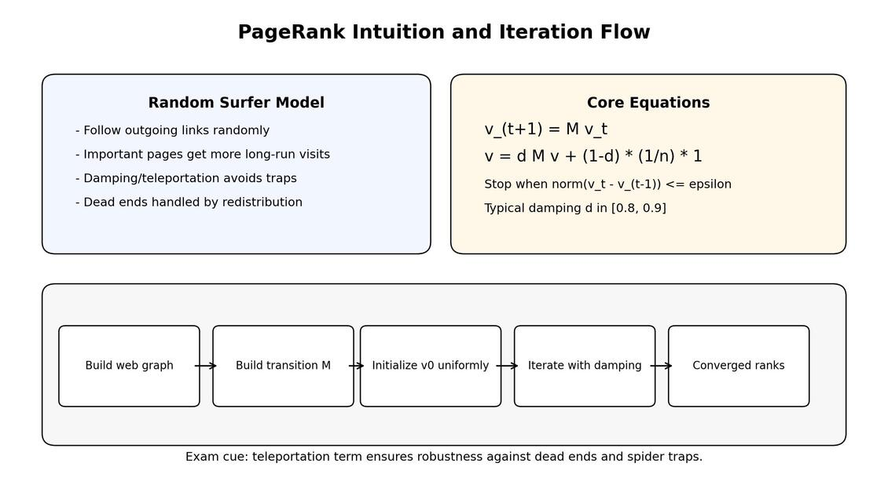

# Lecture 6B Summary: PageRank Algorithm

## 1. Big Picture
PageRank is a link-analysis algorithm for ranking web pages by importance using the web graph structure.

Key intuition:
- Links act like votes.
- Votes from important pages count more.
- Votes from pages with fewer outlinks carry more weight per link.

## 2. Historical Context and Motivation
| Item | Notes |
|---|---|
| Origin | Developed by Larry Page and Sergey Brin (around 1999) |
| Core problem | Ranking useful pages among noisy/spammy web content |
| Why not just inlink count | Raw counts are vulnerable to manipulation and ignore source quality |

## 3. Graph Model
Represent the web as directed graph:
- Node = page
- Directed edge $j \to i$ means page $j$ links to page $i$

Notation used in lecture:
- $B_i$: set of backlinks to page $i$
- $d_j$: out-degree (number of outgoing links) of page $j$
- $r_i$ or $v_i$: PageRank score of node $i$

## 4. Simplified PageRank Equation
Core recursive form:

$$r_i = \sum_{j:\, j \to i} \frac{r_j}{d_j}$$

With normalization constraint for uniqueness:

$$\sum_i r_i = 1$$

Interpretation:
- Page $i$ receives rank mass from pages linking to it.
- Each source page splits its mass equally among its outgoing links.

## 5. Random Surfer Interpretation
PageRank equals long-run visit probability of a random surfer.

Process:
1. Start with uniform distribution over pages.
2. At each step, follow one outgoing link at random.
3. Repeat many times; distribution converges to stationary probabilities.

## 6. Matrix Form and Iteration
Let $M$ be the transition matrix, where:
- $M_{ij} = 1/d_j$ if $j \to i$, else $0$
- Columns sum to 1 for column-stochastic form.

Iterative update:

$$\mathbf{v}_{t+1} = M\,\mathbf{v}_t$$

Stop criterion:

$$\|\mathbf{v}_t - \mathbf{v}_{t-1}\| \leq \varepsilon$$

Power iteration is the scalable computation method for large graphs.

## 7. Why Simplified Version Fails in Practice
| Issue | Problem |
|---|---|
| Dead ends (dangling nodes) | Node with no outlinks absorbs probability mass or breaks stochastic behavior |
| Spider traps | Rank gets trapped in strongly connected subgraph with no outgoing edges |
| Pure link-following only | May not mix fast enough and can produce biased concentration |

## 8. Teleportation / Damping (Modified PageRank)
Use damping factor $d$ and teleport distribution (often uniform):

$$\mathbf{v} = d\,M\,\mathbf{v} + (1-d)\,\frac{1}{n}\,\mathbf{1}$$

Equivalent random-surfer behavior:
- With probability $d$, follow a link.
- With probability $1-d$, jump to random page.

Typical values from lecture context:
- $d$ is in range about $0.8$ to $0.9$ (commonly around $0.85$).

Benefits:
- Handles spider traps.
- Handles dead ends via redistribution/teleportation.
- Improves convergence robustness.

## 9. Dead Ends and Spider Traps (Exam Table)
| Concept | Definition | Standard fix |
|---|---|---|
| Dead end | Page with zero outlinks | Redistribute its mass uniformly / teleport |
| Spider trap | Subgraph with no links out | Damping term allows escape |

## 10. Worked Micro Example Pattern (How to Solve in Tutorials)
Given a small graph:
1. Build adjacency and out-degree table.
2. Construct transition matrix $M$.
3. Initialize $\mathbf{v}_0 = (1/n)\,\mathbf{1}$.
4. If damping is required, iterate using $\mathbf{v}_{t+1} = d\,M\,\mathbf{v}_t + (1-d)\frac{1}{n}\mathbf{1}$.
5. Continue until convergence threshold or fixed iteration count.
6. Rank pages by final $\mathbf{v}$ entries.

## 11. Convergence and Scalability
| Property | Notes |
|---|---|
| Convergence | Empirically converges in finite iterations on large web graphs |
| Mixing intuition | Web behaves sufficiently connected/expander-like for rapid mixing |
| Distributed computing fit | Iterative matrix-vector operations parallelize well |
| Systems impact | PageRank helped motivate large-scale storage/compute systems (e.g., MapReduce/GFS context) |

## 12. PageRank and Real Search Engines
PageRank is one important ranking signal, but not the only one.

Other signals mentioned in lecture context:
- Anchor text
- URL/title/meta/context signals
- Additional proprietary ranking ingredients

## 13. Web Spam and Manipulation
| Spam tactic | Goal |
|---|---|
| Link spamming | Inflate target page rank by creating/controlling backlinks |
| Content/query spamming | Appear relevant to high-value queries |

Takeaway:
- Ranking systems need anti-spam defenses beyond core PageRank.

## 14. Formula Sheet (Exam-Ready)
| Topic | Formula |
|---|---|
| Simplified PageRank | $$r_i = \sum_{j:\, j \to i} \frac{r_j}{d_j}$$ |
| Normalization | $$\sum_i r_i = 1$$ |
| Basic iteration | $$\mathbf{v}_{t+1} = M\,\mathbf{v}_t$$ |
| Damped PageRank | $$\mathbf{v} = d\,M\,\mathbf{v} + (1-d)\,\frac{1}{n}\,\mathbf{1}$$ |
| Convergence check | $$\|\mathbf{v}_t - \mathbf{v}_{t-1}\| \leq \varepsilon$$ |

## 15. Must-Memorize Points
1. PageRank is recursive importance propagation over directed links.
2. Raw inlink count is insufficient; source quality and out-degree matter.
3. Random-surfer model gives probabilistic interpretation of rank.
4. Dead ends and spider traps require damping/teleportation fixes.
5. Power iteration is the practical computation method at scale.
6. PageRank is a major feature, not the entire search ranking function.
