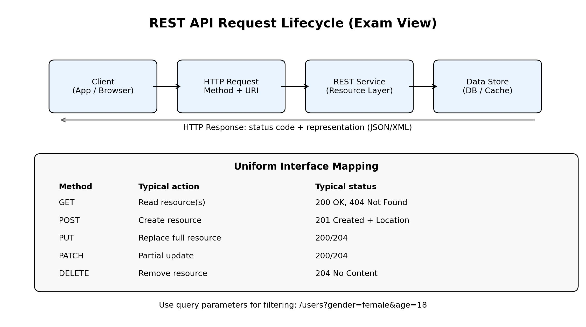

# Lecture 8A Summary: API and REST

## 1. Big Picture
This lecture explains distributed computing via SaaS APIs, with focus on REST-style Web APIs and practical client-side usage.

Core progression:
1. Why machine-to-machine APIs are needed
2. REST architectural style and constraints
3. HTTP as uniform interface (URI, methods, headers, status codes)
4. JSON and Fetch API usage
5. Practical issues: query params, forms, CORS, async event handling

## 2. Why APIs (Beyond Traditional Web Pages)
| Aspect | Traditional Web App | Web API / REST Usage |
|---|---|---|
| Target interface | Human-to-machine (GUI) | Machine-to-machine (API) |
| Typical payload | HTML pages | JSON/XML resources |
| Client behavior | Full/large page refreshes | Resource-level data operations |
| Reuse across clients | Limited | High (web, mobile, backend services) |

## 3. What is an API / Web API
| Term | Meaning |
|---|---|
| API | Programmatic interface for system-to-system communication |
| Web API | API exposed over HTTP |
| GUI | Human-facing interface for interaction |

## 4. Web API Styles Mentioned
| Style | Idea |
|---|---|
| RPC | Call server-side functions |
| RMI | Call methods on remote objects |
| REST | Manipulate resources through standard HTTP semantics |

## 5. REST Overview
REST is an architectural style (not a strict protocol spec), associated with Roy Fielding.

### 5.1 REST Constraints
| Constraint | Practical meaning |
|---|---|
| Client-Server | Separation of concerns between UI/client and data/service |
| Stateless | Each request contains all context needed by server |
| Cache | Responses can be cacheable when appropriate |
| Uniform Interface | Consistent resource and method semantics |
| Layered System | Intermediaries/proxies/gateways can be inserted |
| Code-on-Demand (optional) | Server can extend client behavior by sending code |

## 6. Uniform Interface with HTTP
### 6.1 Resource modeling
- Use URIs as nouns (resources), not action verbs.
- Prefer predictable resource paths and query parameters.

Bad style examples:
- /create-book
- /get-top-10-books

Better style examples:
- POST /books
- GET /top-10-books

### 6.2 CRUD mapping table
| Operation | Preferred HTTP method |
|---|---|
| Create | POST (or PUT when URI predetermined) |
| Retrieve | GET |
| Update full | PUT |
| Update partial | PATCH |
| Delete | DELETE |

### 6.3 Headers and formats
| Header | Purpose |
|---|---|
| Accept | Declares desired response media type |
| Content-Type | Declares request body media type |

Common media types in lecture context:
- application/json
- application/xml

### 6.4 Status-code usage
| Scenario | Typical status |
|---|---|
| Successful read | 200 OK |
| Successful create | 201 Created (+ Location header) |
| Successful update/delete without body | 204 No Content |
| Missing resource | 404 Not Found |

## 7. REST URI Design Patterns
| Need | Example |
|---|---|
| Collection | GET /users |
| Single resource | GET /users/2 |
| Filtering | GET /users?gender=female&age=18 |
| Pagination | GET /users?page=1 |
| Nested data | GET /users/2/pets |

Key guideline:
- Prefer query parameters for optional filters over proliferating path variants.

## 8. JSON and Fetch API
| Topic | Key point |
|---|---|
| JSON | Lightweight serialization format for objects |
| fetch() | Issues GET by default unless options specify method |
| response.json() | Parses JSON response body into object |
| Promise chain | Typical flow: fetch -> onResponse -> onJsonReady |

## 9. Query Parameters and Form Submission
| Topic | Notes |
|---|---|
| Query params | First uses ?, subsequent use &, format key=value |
| Form submit event | Listen on form submit and call event.preventDefault() to avoid full page refresh |
| Input handling | Use input.value and form events to construct API requests |

## 10. CORS (Cross-Origin Resource Sharing)
| Case | Default browser behavior |
|---|---|
| Same-origin request | Allowed |
| Cross-origin fetch/XHR | Blocked unless server enables CORS |
| Cross-origin static resources (img, script, link) | Often allowed by default rules |

Practical takeaway:
- API server must send appropriate CORS headers for browser fetch calls from other origins.

## 11. Async JavaScript and Event Loop (Practical REST Client Reliability)
### 11.1 Why bugs happen
- UI events and network completion happen at unpredictable times.
- Button handlers can run before fetch data is available.

### 11.2 Mitigation patterns
| Pattern | Benefit |
|---|---|
| Disable UI until data loads | Prevent invalid actions |
| Render controls only after data ready | Enforces dependency order |
| Initialize state defensively (e.g., empty arrays) | Handlers become safe before fetch completion |

### 11.3 Event-loop concept summary
| Component | Role |
|---|---|
| Call stack | Executes JS one frame at a time |
| Task queue | Holds callbacks for events/timers |
| Microtask queue | Higher-priority queue (e.g., Promise callbacks) |
| Event loop | Moves queued callbacks to stack when stack is empty |

Important exam point:
- JavaScript runtime is single-threaded, but browser internals can perform I/O/network work concurrently.

## 12. REST Alternatives Mentioned
| Alternative | Notes in lecture context |
|---|---|
| GraphQL | Used by major platforms; flexible query shape |
| Falcor | Netflix-origin alternative mentioned historically |

## 13. API Design Checklist (Exam-Ready)
1. Model resources as nouns and stable URIs.
2. Use HTTP methods semantically (GET/POST/PUT/PATCH/DELETE).
3. Return meaningful status codes and content types.
4. Support filtering/pagination with query parameters.
5. Handle errors explicitly in response schema and status.
6. Consider cacheability, statelessness, and layered deployment.
7. Ensure CORS policy matches browser client requirements.
8. Build frontend logic robust to asynchronous timing.

## 14. Must-Memorize Points
1. REST is an architectural style guided by constraints, not a strict wire-format spec.
2. Uniform interface is central: resource URIs + HTTP methods + headers + status codes.
3. JSON is the dominant API payload format in modern web APIs.
4. CORS is a browser security policy; server config determines cross-origin fetch viability.
5. Promise-based async flow and event-loop behavior are essential for reliable API clients.
6. Good API design optimizes developer usability, not only backend convenience.
