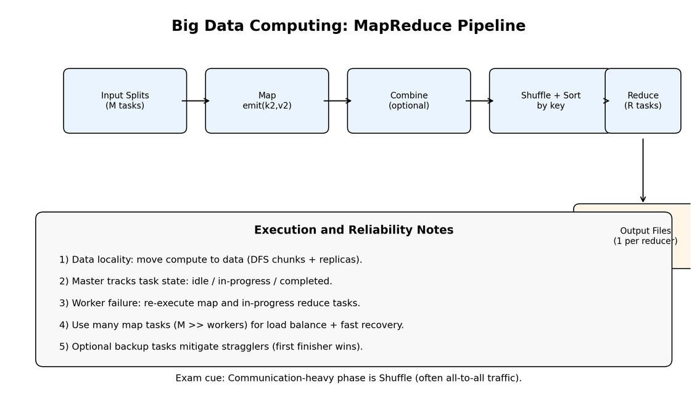

# Lecture 8B Summary: Big Data Computing

## 1. Big Picture
This lecture explains how cloud systems process web-scale data efficiently using distributed storage and MapReduce.

Main themes:
1. Large-scale web search architecture
2. Distributed storage (GFS/HDFS-style)
3. MapReduce programming model and runtime
4. Fault tolerance and scheduling at cluster scale
5. PageRank as a practical MapReduce workload

## 2. Why Big Data Needs Distributed Computing
| Challenge | Implication |
|---|---|
| Data volume (TB-PB scale) | Single-machine processing is too slow |
| Commodity hardware failures | Must assume frequent machine/disk faults |
| Network transfer cost | Prefer moving compute close to data |
| Throughput demand | Need massive parallelism and load balancing |

## 3. Cluster and Storage Foundation
| Component | Role |
|---|---|
| Commodity nodes | CPU + memory + local disks; cheap but unreliable |
| Rack/network hierarchy | High intra-rack bandwidth, lower inter-rack bandwidth |
| Distributed file system | Global namespace over chunked/replicated data |
| Replication | Reliability + parallel read opportunities |

Key storage principle:
- Keep multiple chunk replicas and schedule computation near the data blocks.

## 4. MapReduce: What It Is
MapReduce is a data-parallel model for scalable, fault-tolerant batch processing.

Core abstractions:
- $\text{map}(k, v) \to \text{list}(k_2, v_2)$
- $\text{reduce}(k_2, \text{list}(v_2)) \to \text{list}(k_3, v_3)$

Execution pipeline:
1. Split input into $M$ shards
2. Run map tasks in parallel
3. Shuffle/sort intermediate pairs by key
4. Run $R$ reduce tasks
5. Write outputs ($R$ output files)

## 5. Design Goals (Exam Table)
| Goal | How achieved |
|---|---|
| Scalability | Many parallel tasks across many nodes |
| Cost efficiency | Commodity machines + simple programming model |
| Fault tolerance | Task re-execution, heartbeats, master coordination |
| Ease of programming | User only writes map/reduce logic |

## 6. MapReduce Roles and Runtime Responsibilities
| Responsibility | Runtime handles it? |
|---|---|
| Input partitioning and scheduling | Yes |
| Group-by-key (shuffle/sort/partition) | Yes |
| Inter-machine communication | Yes |
| Failure recovery | Yes |
| Map/reduce business logic | Programmer provides |

## 7. Key Execution Parameters
| Parameter | Meaning | Rule of thumb |
|---|---|---|
| $M$ | Number of map tasks | Choose $M$ much larger than worker count |
| $R$ | Number of reduce tasks | Usually smaller than $M$ |
| Input split size | Per-map data chunk | Often aligned with DFS chunks |

Why $M \gg \text{workers}$:
- Better dynamic load balancing
- Faster recovery from worker failure

## 8. Shuffle, Combiner, and Communication Cost
| Concept | Purpose | Caveat |
|---|---|---|
| Shuffle + sort | Bring all same-key values together | Communication-heavy (often all-to-all pattern) |
| Combiner (optional) | Local pre-aggregation to reduce network traffic | Only local; cannot fully replace reducer aggregation |

## 9. Fault Tolerance and Stragglers
| Failure type | Runtime behavior |
|---|---|
| Map worker failure | Re-run completed/in-progress map tasks from that worker |
| Reduce worker failure | Re-run in-progress reduce tasks |
| Master failure | Job may abort (implementation-dependent recovery) |

Straggler mitigation:
- Launch speculative backup copies near job end.
- First completion wins.

## 10. Canonical Example: Word Count
### Map
For each word $w$ in the input record, emit $(w, 1)$.

### Reduce
For each key $w$, sum all counts and emit $(w, \text{total})$.

Why this is ideal for MapReduce:
- Embarrassingly parallel map stage
- Associative/commutative reduce operation

## 11. PageRank on MapReduce (Lecture Workflow)
### Step 1: Build link structure records
- Parse pages/links and produce per-page outgoing-link lists and initial rank.

### Step 2: Iterative rank update (repeated MR jobs)
- Map emits rank contributions to linked pages.
- Reduce aggregates incoming contributions to compute new rank.
- Repeat until convergence threshold.

### Step 3: Sort by final rank
- Emit $(\text{PageRank}, \text{URL})$ and leverage framework sorting.

## 12. PageRank Formula Context
Simplified rank propagation concept:

$$R(u) \propto \sum_{v \in \text{backlinks}(u)} \frac{R(v)}{\text{outdeg}(v)}$$

Practical implementations use iterative updates and convergence checks (not exact one-shot solve at web scale).

## 13. Performance and Scaling Insights
| Insight | Meaning |
|---|---|
| Data locality matters | Network is expensive relative to local disk/compute |
| Shuffle dominates cost often | Minimize intermediate data volume where possible |
| Chaining MR jobs is common | Complex analytics built from simple map/reduce blocks |
| Framework overhead is worthwhile | Reliability and scale outweigh orchestration cost |

## 14. Big Data + Search Pipeline Connection
Lecture connects:
1. Query serving architecture (front-end/load balancer/index/ad system)
2. Offline index construction and ranking using distributed compute
3. PageRank as one ranking signal among many

## 15. Must-Memorize Points
1. Big data systems assume failure as normal, not exceptional.
2. MapReduce separates user logic (map/reduce) from distributed-systems complexity.
3. Shuffle/sort is central and often the main bottleneck.
4. Combiner helps reduce network traffic but only locally.
5. Choose many map tasks for balancing and fault recovery.
6. PageRank is naturally iterative and implemented via chained MapReduce jobs.
7. Distributed storage + distributed compute co-design is key to cloud-scale analytics.
