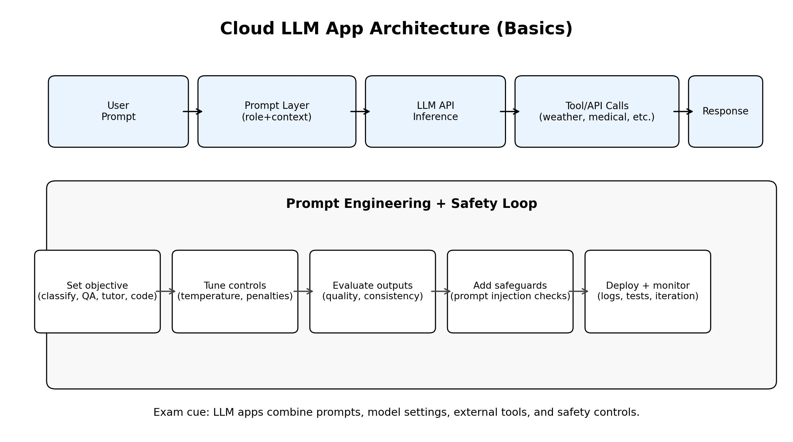

# Lecture 9A Summary: Cloud LLM Apps Basics

## 1. Big Picture
This lecture introduces how cloud infrastructure enables practical Large Language Model (LLM) applications (e.g., Copilot, ChatGPT-like systems, task-specific bots).

Main themes:
1. AI and LLM foundations
2. Prompt engineering as the control layer
3. Building cloud LLM apps with external tools/APIs
4. AI-assisted programming use cases
5. LLM safety and cybersecurity risks

## 2. Underlying Technology Stack
| Layer | Role |
|---|---|
| AI / ML foundations | Core learning framework behind intelligent behavior |
| Neural networks / transformers | Model architecture for sequence/language processing |
| Large Language Models | Generate and reason over text/code from prompts |
| Prompt engineering | Steers model behavior for specific tasks |
| Cloud APIs + tooling | Connects model outputs to real-time functions/data |

## 3. What LLM Apps Do (Lecture Examples)
| Capability type | Example tasks |
|---|---|
| Generative capability | Language teaching, quizzes, text generation |
| Reasoning capability | Game logic (e.g., tic-tac-toe / nim-style reasoning) |
| Assistant workflows | Tutoring, travel assistance, medical support, coding help |

## 4. Prompt Engineering Fundamentals
Prompt engineering = designing instructions/context so model outputs match desired behavior.

### Why it matters
| Benefit | Practical impact |
|---|---|
| Better task performance | More relevant, structured responses |
| Faster development | Less trial-and-error in app behavior |
| Limitation testing | Helps identify model failure modes |
| Safety tuning | Can reduce harmful/unreliable outputs |

### Prompt task styles mentioned
- Text classification
- Question answering
- Role-playing
- Summarization
- Code generation
- Reasoning

## 5. Key Prompt/Model Controls (High-Yield)
| Control | Effect | Typical tradeoff |
|---|---|---|
| Temperature | Higher -> more randomness/creativity; lower -> more determinism | Creativity vs predictability |
| Frequency/repetition penalties | Reduces repeated tokens/phrases | Lower repetition vs possible fluency impact |
| Cycle detection handling | Detects repetitive loops in outputs | Need truncation/intervention logic |
| Sampling multiple outputs | Generate candidates and select best | Better quality vs higher cost/latency |

Exam memory line:
- Prompt quality + parameter tuning jointly control output quality.

## 6. Cloud LLM App Architecture Pattern
Typical pattern:
1. User sends prompt.
2. Prompt layer adds role/context/instructions.
3. LLM API generates candidate response.
4. App may call external APIs/tools (weather, transport, scheduling, etc.).
5. Response returned and optionally logged/evaluated for refinement.

## 7. Nemo Bot Project Case Studies (from lecture)
| Bot | Main idea | Notable design feature |
|---|---|---|
| Tourism bot | Recommend attractions + transport/weather-aware help | Integrates external APIs (weather, transit info) |
| Medical bot | Symptom guidance, scheduling/reminders, health tips | LLM + tool-based workflow for user support |
| Virtual Teacher bot | Guide user to think instead of giving full answer immediately | Prompt role constraints + patience/state control |

## 8. AI-Assisted Programming
| Topic | Notes |
|---|---|
| Goal | Improve developer productivity for complex coding tasks |
| Example tools | GitHub Copilot, AlphaCode, Copilot for Xcode |
| Typical features | Code generation, unit-test generation, code summarization |
| Practical caveat | Most useful with experienced developers who can validate outputs |

## 9. Code Summarization (Lecture Emphasis)
| Aspect | Summary |
|---|---|
| Definition | Generate natural-language descriptions of code |
| Common approach | Sequence-to-sequence neural modeling |
| Input representations | Token-based, tree-based, graph-based |
| Use case | Documentation assistance and program understanding |

## 10. LLM Cybersecurity and Safety Risks
| Risk area | Description |
|---|---|
| Prompt injection | Malicious prompts to override intended instructions |
| Prompt leaking | Exposure of hidden/system prompt content |
| Jailbreaking | Attempts to bypass safety/policy guardrails |
| Reliability risk | Unsafe/harmful or incorrect outputs under adversarial inputs |

### Safety-oriented practice from lecture context
- Use prompt engineering not only for quality but also for safety.
- Red-team/testing mindset helps discover risky behaviors early.

## 11. Practical Build Checklist (Exam-Ready)
1. Define task objective clearly (classification, tutoring, coding, etc.).
2. Design prompt template (role + constraints + output format).
3. Tune parameters (temperature, penalties) for target behavior.
4. Add tool/API integration where factual or real-time data is needed.
5. Implement state/guardrails (limits, fallback, loop handling).
6. Evaluate with test prompts and adversarial safety probes.
7. Monitor production behavior and iterate.

## 12. Must-Memorize Points
1. Cloud LLM apps are not just models; they are pipelines combining prompts, model settings, tools, and safety controls.
2. Prompt engineering is a core engineering skill, not just prompt wording.
3. Temperature and repetition controls strongly affect response behavior.
4. Real-world LLM apps often require external API/tool calls for reliable utility.
5. AI-assisted coding boosts productivity but requires human verification.
6. Prompt injection, leakage, and jailbreaking are central security concerns.
7. Robust systems require iterative testing, monitoring, and safety refinement.
