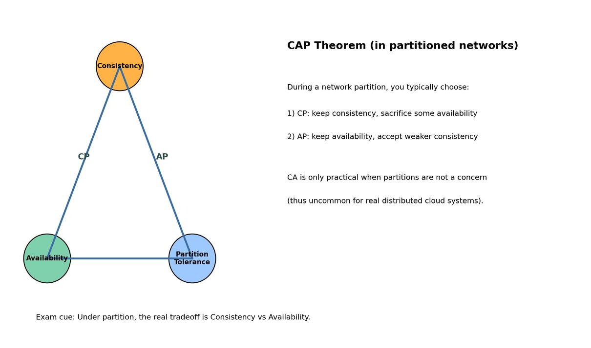
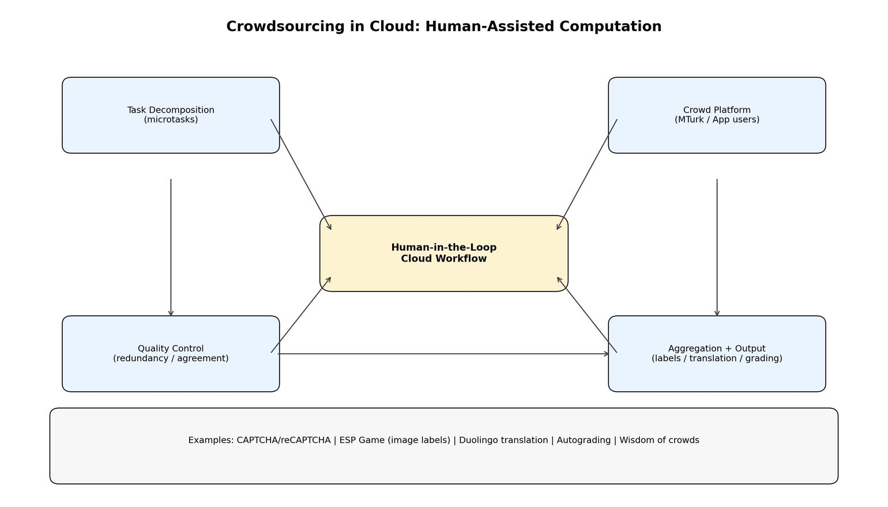

# Lecture 1 Summary: Cloud Computing Basics

## 1. What is Cloud Computing?
Cloud computing is a model that provides ubiquitous, convenient, on-demand network access to a shared pool of configurable resources (e.g., servers, storage, networks, applications, services) that can be rapidly provisioned and released with minimal management effort.

The lecture references the NIST definition and emphasizes cloud as utility-style computing: users consume resources like electricity and pay based on usage.

## 2. Real-World Context and Scale
The lecture illustrates cloud scale through large provider data centers and infrastructure:
- Massive server fleets and global data centers (e.g., hyperscalers).
- Highly engineered facilities: racks, networking rooms, cooling and power systems.
- Cloud ecosystem includes providers, platforms, and cloud-based applications.

## 3. Core Cloud Characteristics
| Characteristic | What It Means | Why It Matters (Exam Point) |
|---|---|---|
| On-Demand Self-Service | Users provision compute/storage automatically without manual provider interaction. | Fast setup, low overhead, supports rapid experimentation. |
| Broad Network Access | Services are reachable over standard networks from phones, tablets, laptops, and workstations. | Enables anywhere access and edge-to-cloud data flow. |
| Resource Pooling | Multi-tenant pooled resources are dynamically assigned to users; physical location is abstracted. | Improves provider utilization and cost efficiency. |
| Rapid Elasticity | Capacity can scale up or down quickly based on demand. | Handles workload spikes better than static provisioning. |
| Measured Service | Usage is monitored and metered for transparent billing. | Supports pay-as-you-go and cloud economics optimization. |

## 4. Deployment Models Mentioned
The lecture notes mention four cloud deployment patterns:
- Private cloud
- Public cloud
- Hybrid cloud
- Multi-cloud

## 5. Service Models: IaaS, PaaS, SaaS
| Model | What Provider Manages | What User Manages | Typical Use | Main Tradeoff |
|---|---|---|---|---|
| IaaS | Physical servers, networking, storage, virtualization layer | OS, runtime, middleware, apps, data | Custom infrastructure and maximum control | Highest flexibility, highest management effort |
| PaaS | Infrastructure + OS + runtime/platform tools | Application code and data | Rapid app development/deployment | Faster development, less low-level control |
| SaaS | Full application stack including updates and operations | Mostly configuration and usage | End-user/business software over Internet | Easiest to use, least infrastructure control |

### Quick examples from lecture context
| Model | Example Type |
|---|---|
| IaaS | Renting cloud servers/storage for large-scale streaming workloads |
| PaaS | Managed app platforms and service APIs/language ecosystems |
| SaaS | Google Apps, Office 365, cloud collaboration/business tools |

## 6. Virtualization Concepts (IaaS Foundation)
Virtualization abstracts physical hardware into virtual machines with allocated CPU/memory and software environments.
- Hypervisor/VMM manages multiple guest OS instances on one host.
- Supports isolation, consolidation, and dynamic allocation.
- Para-virtualization can approach near-native performance.

## 7. Comparison Insight Across IaaS/PaaS/SaaS
| Dimension | IaaS | PaaS | SaaS |
|---|---|---|---|
| Flexibility/Control | High | Medium | Low |
| Built-in Functionality | Low | Medium | High |
| User Management Burden | High | Medium | Low |
| Speed to Deploy | Medium | High | Very High |
| Best For | Infrastructure customization | Application development | Ready-to-use software consumption |

**Exam memory line:** Moving from IaaS -> PaaS -> SaaS means less control but more convenience and abstraction.

## 8. Opportunities and Benefits
Cloud creates opportunities via economies of scale and lower barriers to entry:
- Reduced upfront cost for startups (shift from capex to opex).
- Elastic, on-demand consumption.
- Potentially unlimited storage and better reliability via replication.
- Better performance on client devices (offloaded workloads).
- Automatic updates and improved collaboration/document sharing.
- Device and location independence.

## 9. Risks and Disadvantages
The lecture also stresses practical limitations and concerns:
- Dependence on Internet connectivity and bandwidth.
- Potential latency/slowness for web-based workloads.
- Feature gaps vs traditional desktop software in some cases.
- Security, privacy, data ownership, and policy/jurisdiction issues.
- Vendor lock-in due to differing APIs/protocols.
- Service outage/account lockout risks.
- HPC constraints for tightly coupled parallel jobs (e.g., MPI/OpenMP) due to scheduling/latency concerns.

## 10. Extended Idea: Social Cloud Computing
The lecture briefly introduces social cloud computing:
- Peer-based sharing/bartering/renting of resources.
- Relies on trust, social/reputation mechanisms.
- Related to decentralized and Web 3.0 style applications.

## 11. Key Takeaways
- Cloud computing is utility-style, network-delivered computing with elastic scaling and measured usage.
- The 5 core characteristics (self-service, network access, pooling, elasticity, measured service) define cloud behavior.
- IaaS, PaaS, SaaS differ mainly by control vs convenience.
- Cloud offers strong economic and operational benefits but introduces security, governance, and dependency risks.
- Choosing the right model requires balancing flexibility, cost, speed, and risk tolerance.
\n
# Lecture 2 Summary: Data Center Networking

## 1. Big Picture
This lecture connects classic networking fundamentals to modern data center network design.

Core storyline:
1. Internet basics (switching, addressing, routing, performance, layering)
2. Transport behavior (TCP reliability, flow control, congestion control)
3. Why data center topologies evolved from hierarchical designs to Clos/fat-tree
4. Traffic patterns and congestion issues in production DCs
5. DCTCP as a practical congestion-control improvement for DC workloads

## 2. Networking Fundamentals (Exam Table)
| Topic | Key Idea | Exam Tip |
|---|---|---|
| Nodes and links | Nodes include hosts, switches, routers; links can be wired/wireless, point-to-point/shared | Be able to identify forwarding elements vs endpoints |
| Circuit switching | Dedicated path after setup | Predictable but inefficient for bursty traffic |
| Packet switching | Data split into packets over shared links | Better statistical multiplexing; can queue/drop |
| Addressing | Unicast, broadcast, multicast | Know destination granularity of each |
| Routing | Forward packet based on destination address | Router checks local network vs next hop |
| Multiplexing | TDM/FDM and statistical multiplexing | Statistical multiplexing gives gain when users are bursty |

## 3. Performance Metrics
| Metric | Definition | Simple Formula |
|---|---|---|
| Bandwidth / Throughput | Data rate over link/path | 1 MBps = 8 Mbps |
| Propagation delay | Signal travel time | distance / c |
| Transmission delay | Time to push bits onto link | packet_size / link_bandwidth |
| Queueing delay | Waiting time in buffers | rises sharply near congestion |
| End-to-end latency | Total path delay | propagation + transmission + queueing |

### Interpretation for workload size
| Workload Type | Dominant Concern |
|---|---|
| Very short/small flows | Queueing and latency |
| Large flows | Throughput (transmission time) |

## 4. Layering and TCP/IP
| Layer | Main Responsibility | Example |
|---|---|---|
| Application | App-specific protocols/data | HTTP, email |
| Transport | End-to-end delivery semantics | TCP, UDP |
| Network | Internetwork routing/addressing | IP |
| Link (MAC) | Local-link access | Ethernet, 802.11 |
| Physical | Bit representation on medium | Fiber, DSL, Bluetooth |

Why layering matters:
- Separation of concerns
- Interoperability across heterogeneous technologies
- Replace one layer implementation without redesigning all layers

## 5. IP and Routing Essentials
| Item | Notes |
|---|---|
| IP service model | Connectionless, best-effort, no delivery guarantees |
| Typical impairments | Loss, delay, reordering |
| Router behavior | If destination network is directly connected, deliver locally; else forward to next hop |

## 6. TCP Essentials for Data Centers
| Feature | Purpose | Mechanism |
|---|---|---|
| Reliability | In-order correct delivery | Sequence numbers + ACKs + retransmission |
| Flow control | Protect receiver buffers | Receiver window (`rwnd`) |
| Congestion control | Protect network from overload | Congestion window (`cwnd`) + loss/ECN signals |

### AIMD behavior (classical TCP)
| Phase | Rule |
|---|---|
| Additive increase | Increase `cwnd` gradually while no congestion detected |
| Multiplicative decrease | On congestion signal, reduce `cwnd` significantly (often by half) |

### AIMD formulas (exam-focused)
Let $W$ be the congestion window in MSS units.

| Case | Formula | Notes |
|---|---|---|
| Additive increase (per RTT) | $W_{t+1} = W_t + \alpha$ | Classical TCP Reno congestion avoidance uses $\alpha = 1$ MSS/RTT |
| Multiplicative decrease (on congestion event) | $W \leftarrow \beta W$ | Classical Reno often uses $\beta = 1/2$ |
| Sawtooth average window | $W_{\text{avg}} \approx \frac{W_{\text{max}} + W_{\text{max}}/2}{2} = \frac{3W_{\text{max}}}{4}$ | For $\beta = 1/2$ |

Generalized AIMD (often seen in tutorials):
- Flow $i$: $W_i(k+1) = \beta_i W_i(k) + \dfrac{\alpha_i}{\sum_j \alpha_j} \sum_j \bigl(1-\beta_j\bigr)W_j(k)$
- Steady-state fairness direction: $W_i^* \propto \dfrac{\alpha_i}{1-\beta_i}$
- If all flows use $\alpha_i = 1,\; \beta_i = 1/2$, then fair equilibrium is equal windows.

Worked mini example:
- Start $W = 10$ MSS, $\alpha = 1$, $\beta = 1/2$
- After 3 RTTs without congestion: $W = 13$
- Congestion occurs: $W \leftarrow 13/2 = 6.5$ MSS (implementation rounds by stack rules)

Important caveat from lecture:
- Packet drops/duplicate ACKs are imperfect congestion signals in some environments (e.g., wireless/path changes).

## 7. Data Center Topology Evolution
The lecture uses Google network evolution to show why old designs stopped scaling.

| Era / Design | Characteristics | Limitation / Motivation to Change |
|---|---|---|
| Traditional hierarchical / four-post (early) | Cluster routers + ToR hierarchy | Expensive high-radix devices, oversubscription, limited per-host bandwidth growth |
| Firehose generations | Early Close-style scale-out with commodity components | Operational complexity and resilience challenges |
| Watchtower / Saturn / Jupiter | Larger Close fabrics, higher bisection bandwidth, centralized control refinements | Need better manageability, fault handling, and massive scale |

Key design principles repeatedly emphasized:
- Close topologies for scalability + path diversity
- Merchant silicon (commodity switch chips) for cost-effective upgrades
- Centralized control view to manage complexity in large fabrics

## 8. Close and Fat-Tree (High-Yield Exam Section)

### 8.1 Why Clos/fat-tree?
| Problem in traditional tree | Clos/fat-tree advantage |
|---|---|
| Expensive core switches with scale-up model | Scale-out using many commodity switches |
| Oversubscription bottlenecks | More equal-cost paths and higher bisection options |
| Poor fault tolerance | Redundancy and multipath diversity |

### 8.2 Fat-tree formulas (k-port switch)
| Quantity | Formula |
|---|---|
| Number of pods | $k$ |
| Core switches | $(k/2)^2$ |
| Hosts per edge switch | $k/2$ |
| Total supported hosts | $k^3/4$ |
| Approx. total switches | $5k^2/4$ |

Derivation details (for exam proofs):
- Assume $k$ is even and every switch has $k$ ports.
- Per pod:
	- Edge switches = $k/2$
	- Aggregation switches = $k/2$
	- Hosts per edge = $k/2$
	- Hosts per pod = $(k/2) \times (k/2) = k^2/4$
- Total hosts across $k$ pods:
	- $N_{\text{hosts}} = k \times (k^2/4) = k^3/4$
- Core switches:
	- $N_{\text{core}} = (k/2)^2 = k^2/4$
- Total switches:
	- Pod switches = $k \times (k/2 + k/2) = k^2$
	- $N_{\text{total}} = k^2 + k^2/4 = 5k^2/4$

Useful link-count formulas:
- Edge-aggregation links per pod: $(k/2) \times (k/2) = k^2/4$
- Total edge-aggregation links: $k \times (k^2/4) = k^3/4$
- Total aggregation-core links: also $k^3/4$

Example cited in lecture context:
- 48-port 1GigE fat-tree can scale to around 27,648 hosts using around 2,880 switches.

Worked example ($k = 8$):
- Pods = $8$
- Edge per pod = $4$, Aggregation per pod = $4$
- Hosts per edge = $4$
- Hosts per pod = $4 \times 4 = 16$
- Total hosts = $8 \times 16 = 128$ (matches $k^3/4 = 8^3/4 = 128$)
- Core switches = $(8/2)^2 = 16$
- Total switches = $5 \times 8^2/4 = 80$

### 8.3 Non-blocking concept
| Term | Meaning |
|---|---|
| Rearrangeably non-blocking | For any traffic matrix, there exists some path assignment that can realize full available host bandwidth |
| Practical implication | Better support for dynamic east-west DC traffic than simple hierarchical trees |

### 8.4 How to construct a k-port fat-tree (illustrative)

Construction recipe:
1. Choose even $k$.
2. Create $k$ pods.
3. In each pod, place $k/2$ edge and $k/2$ aggregation switches.
4. Connect each edge switch to all aggregation switches in the same pod.
5. Connect each edge switch's remaining $k/2$ ports to hosts.
6. Create $(k/2)^2$ core switches, arranged as $k/2$ groups of $k/2$.
7. Connect each aggregation switch to one core switch in each core group (so each aggregation has $k/2$ uplinks).

Small construction example ($k = 4$):
- Pods: 4
- Per pod: 2 edge + 2 aggregation
- Core: $(4/2)^2 = 4$
- Hosts per edge: $2$, total hosts $= 4^3/4 = 16$
- Wiring intuition:
	- Inside each pod: full bipartite connection between 2 edge and 2 aggregation switches.
	- Across pods: each aggregation switch uses 2 uplinks, each to a different core group.
	- Each core switch has one downlink into each pod.

Exam check rule:
- If your constructed topology does not satisfy $\text{hosts} = k^3/4$ and $\text{core} = (k/2)^2$, re-check pod and core-group wiring.

## 9. Traffic Characteristics in Data Centers
| Observation | Why It Matters |
|---|---|
| Mice vs elephant flows | Many small flows; few large flows carry most bytes |
| Locality differs by workload | Some services are highly distributed across racks/pods |
| Edge/core utilization is uneven | A single uniform topology may overprovision some regions and congest others |

Exam takeaway:
- Flow-aware load balancing and congestion management are essential; treating all flows equally is inefficient.

## 10. DCTCP (Data Center TCP)
DCTCP is introduced to handle the DC tension between:
- Low latency for short/query traffic
- High throughput for large/background traffic
- Tolerance to bursty incast behavior

### DCTCP vs classical TCP (conceptual)
| Aspect | Classical TCP | DCTCP |
|---|---|---|
| Main congestion signal | Loss/dupACK (coarse) | ECN marking extent (finer-grained) |
| Window adjustment | More binary/coarse reaction | Proportional response to congestion level |
| Queue objective | Can allow larger queue oscillations | Keep queue occupancy lower while maintaining throughput |
| Best-fit environment | General Internet baseline | Controlled data center fabrics with ECN support |

## 11. Incast and Queue Buildup
| Phenomenon | Description | Effect |
|---|---|---|
| Incast | Many senders transmit to one receiver simultaneously | Sudden queue buildup, drops, latency spikes |
| Buffer tradeoff | Deep buffers absorb bursts but raise latency; shallow buffers reduce latency but reduce burst tolerance | Motivates ECN/DCTCP-style control |

## 12. Quick Comparison Sheet (For Revision)
| Dimension | Traditional Hierarchical DCN | Clos/Fat-tree DCN |
|---|---|---|
| Scaling strategy | Scale-up (bigger core boxes) | Scale-out (many commodity switches) |
| Cost profile | High-end hardware heavy | Better cost/performance via merchant silicon |
| Path diversity | Lower | Higher (multipath) |
| Fault tolerance | Lower graceful degradation | Better redundancy |
| Management complexity | Simpler topology, less flexible | Higher complexity; often needs stronger control plane |

## 13. Must-Memorize Points
1. End-to-end latency is the sum of propagation, transmission, and queueing delays.
2. IP is best-effort; TCP adds reliability and congestion/flow control.
3. AIMD: increase gradually, decrease sharply on congestion.
4. Clos/fat-tree solves scale and bandwidth limits of classic hierarchical DCNs.
5. Fat-tree with k-port switches supports $k^3/4$ hosts.
6. Data center traffic has many mice flows and fewer elephant flows; engineering must handle both.
7. DCTCP uses ECN feedback to maintain low queues and high throughput in data centers.
\n
# Lecture 3 Summary: Virtualization in Cloud

## 1. Big Picture
Virtualization abstracts physical resources (CPU, memory, storage, network) so multiple isolated environments can run on the same hardware.

Why it matters in cloud:
- Better hardware utilization
- Faster provisioning (elasticity)
- Isolation between workloads
- Easier management, migration, and scaling

## 2. Core Concept (Exam Table)
| Item | Non-Virtualized Model | Virtualized Model |
|---|---|---|
| Server usage | One server per application (low utilization) | Multiple VMs per physical host (higher utilization) |
| HW/SW coupling | Tight coupling | Decoupled via virtualization layer |
| Isolation | Process-level only | VM-level strong isolation |
| Scaling | Slow (buy/install server) | Fast (start VM instance/image) |

## 3. Key Architectures

### 3.1 Hosted vs Hypervisor Architecture
| Architecture | Where virtualization layer runs | Hardware access path | Typical use | Main tradeoff |
|---|---|---|---|---|
| Hosted | As an application on top of host OS | Indirect via host OS | Desktop/dev/testing | Easier setup, lower performance |
| Bare-metal Hypervisor | Directly on hardware | Direct | Production/cloud DC | Higher performance, better scalability/robustness |

Exam memory line:
- Hosted = convenience first
- Bare-metal hypervisor = performance and production first

## 4. OS/CPU Basics Needed for Virtualization

### 4.1 Fundamental OS Concepts
| Concept | Meaning | Why virtualization cares |
|---|---|---|
| Thread | Single execution context (PC, registers, stack) | CPU state must be switched/saved/restored correctly |
| Address space | Program-visible virtual memory | Isolation and memory translation are essential |
| Process | Address space + one/more threads + resources | VM isolation builds on protection ideas |
| Dual mode | User mode vs kernel (privileged) mode | Hypervisor must control privileged operations |

### 4.2 Protection and Privilege
| Mechanism | Purpose |
|---|---|
| Privileged instructions | Restrict sensitive operations to trusted layer |
| Address translation | Protect OS/processes from unauthorized memory access |
| Trap/syscall/interrupt flow | Controlled transition between unprivileged and privileged execution |
| Protection rings (x86) | Hardware-enforced privilege hierarchy |

## 5. Types of CPU Virtualization

### 5.1 Comparison Table
| Type | How it works | Guest OS modification | Performance | Typical notes |
|---|---|---|---|---|
| Full virtualization | Hypervisor emulates full hardware; traps/translates sensitive ops | No | Lower (emulation/translation overhead) | Maximum compatibility |
| Para-virtualization | Guest OS is virtualization-aware; uses hypercalls | Yes (or PV drivers) | Better than full virtualization | Needs guest support |
| Hardware-assisted virtualization | CPU features (e.g., Intel VT-x, AMD-V) provide virtualization support | Usually no major guest changes | Best practical server performance | Dominant in modern clouds |

### 5.2 Full Virtualization Notes
| Aspect | Key idea |
|---|---|
| Binary translation | Non-virtualizable privileged instructions translated into safe sequences |
| Trap-and-emulate | Sensitive guest operations trapped by hypervisor and emulated |
| Benefit | Unmodified guest OS portability |
| Drawback | Performance penalty compared with newer approaches |

### 5.3 Para-Virtualization Notes
| Aspect | Key idea |
|---|---|
| Hypercalls | Guest explicitly calls hypervisor for privileged services |
| Guest awareness | Guest kernel knows it is virtualized |
| Benefit | Reduced emulation overhead, improved performance |
| Limitation | Requires modified guest kernel or PV drivers |

## 6. Virtualization and IaaS Cloud

Cloud relevance:
- Elasticity depends on fast VM lifecycle operations.
- Cloud infrastructure is effectively a VM management system.

### 6.1 IaaS Building Blocks (from lecture flow)
| Component | Role |
|---|---|
| Controller node | Orchestration/scheduling/control |
| Compute node | Runs VM instances |
| VM image storage | Stores reusable VM images |
| SAN/iSCSI path | Provides network-accessible storage and image transfer |

### 6.2 Why VM abstraction enables cloud business model
| Capability | Cloud effect |
|---|---|
| Image-based deployment | Rapid launch/replication of instances |
| Isolation | Multi-tenant sharing with lower interference risk |
| Encapsulation | Move/start/stop/resume instances quickly |
| Decoupling from hardware | Easier scaling and operations across heterogeneous servers |

## 7. Storage Virtualization: RAID (High-Yield)
The lecture extends virtualization ideas to storage: combine multiple physical disks into one logical virtual disk system.

### 7.1 RAID Levels in Lecture
| RAID Level | Method | Capacity efficiency | Fault tolerance | Performance notes |
|---|---|---|---|---|
| RAID 0 | Striping only | High (all disks usable) | None (1 disk failure can fail array) | High throughput |
| RAID 1 | Mirroring | ~50% usable | Survives single-disk failure per mirror pair | Good read performance, higher storage cost |
| RAID 5 | Striping + distributed parity (XOR) | Loses ~1 disk worth | Survives 1 disk failure | Writes incur parity update overhead |
| RAID 6 | Striping + dual parity (e.g., RS coding) | Loses ~2 disks worth | Survives 2 disk failures | Better resilience for large arrays |

### 7.2 How each RAID works (illustrative)
| RAID | Data layout and write path | What happens on failure |
|---|---|---|
| RAID 0 | Data is striped across disks in chunks. Example with 4 disks: block sequence A1, A2, A3, A4 goes to Disk1..Disk4, then next stripe B1..B4, etc. | Any single disk failure loses part of every striped file, so array becomes unusable. |
| RAID 1 | Every write is duplicated to a mirror disk (or mirror set). Reads can come from either copy. | If one disk in a mirror fails, data is still served from the surviving mirror member. |
| RAID 5 | For each stripe, one block is parity (XOR of data blocks), and parity position rotates across disks. Small writes usually require read-old-data + read-old-parity + write-new-data + write-new-parity. | Survives one disk failure by reconstructing missing block using XOR of remaining blocks in stripe. |
| RAID 6 | Similar to RAID 5 but with two independent parity blocks (commonly P and Q) per stripe. | Survives any two disk failures in the same array; recovery uses coding equations from surviving blocks. |

### 7.3 Mathematical formulas (capacity, reliability, performance)
Assume:
- number of disks = n
- size per disk = S
- independent single-disk failure probability in a period = p

| RAID | Usable capacity | Storage efficiency | Fault tolerance |
|---|---|---|---|
| RAID 0 | nS | 1 | 0 disk failures |
| RAID 1 (pairs) | (n/2)S | 1/2 | 1 failure per mirror pair |
| RAID 5 | (n-1)S | (n-1)/n | any 1 disk failure |
| RAID 6 | (n-2)S | (n-2)/n | any 2 disk failures |

Approximate array failure probability in one period (small p approximation):
- RAID 0: P(fail) = 1 - (1 - p)^n approximately np
- RAID 1 with n/2 mirrored pairs: P(fail) = 1 - (1 - p^2)^(n/2) approximately (n/2)p^2
- RAID 5 (2+ failures): P(fail) approximately C(n,2)p^2
- RAID 6 (3+ failures): P(fail) approximately C(n,3)p^3

Write penalty (small random writes, conceptual I/O count):
- RAID 0: ~1 data write
- RAID 1: ~2 writes (both mirrors)
- RAID 5: ~4 I/Os (read old data, read old parity, write new data, write new parity)
- RAID 6: ~6 I/Os (similar idea with two parities)

### 7.4 XOR parity idea and recovery equations
| Given | Recover missing value |
|---|---|
| P = A XOR B XOR C XOR ... | Missing block X = P XOR (XOR of all surviving data blocks in the stripe) |

Mini example (RAID 5 stripe):
- Data blocks: D1 = 5, D2 = 9, D3 = 12
- Parity: P = D1 XOR D2 XOR D3
- If D2 fails, reconstruct by D2 = P XOR D1 XOR D3

Why this matters:
- Enables reconstruction after disk failure with less storage overhead than full replication.

### 7.5 Quick exam compare: when to use which RAID
| RAID | Best when | Not ideal when |
|---|---|---|
| RAID 0 | Need maximum throughput/capacity and data is disposable or replicated elsewhere | Need reliability |
| RAID 1 | Need simple strong redundancy and fast reads | Capacity efficiency is critical |
| RAID 5 | Need balanced capacity + single-failure protection | Heavy random write workloads |
| RAID 6 | Large arrays where dual-failure tolerance is required | Very write-heavy workloads with low latency targets |

## 8. Practical Performance Themes
| Theme | Exam interpretation |
|---|---|
| Latency hierarchy (ns to ms scale) | Data location dominates performance decisions |
| Caching everywhere | Trade memory/cost for lower average access latency |
| VM overhead considerations | Architecture choice (hosted/PV/HW-assisted) impacts end-to-end app performance |

## 9. Advantages and Limitations of Virtualization
| Advantages | Limitations / Risks |
|---|---|
| Higher utilization and consolidation | Overhead (especially older full virtualization) |
| Fast provisioning and elasticity | Performance unpredictability under contention |
| Isolation and portability | Complexity in management and security hardening |
| Easy replication and scale-out | Storage/network bottlenecks still apply |

## 10. Exam Quick Compare Sheet
| Dimension | Hosted | Full Virtualization | Para-Virtualization | Hardware-Assisted |
|---|---|---|---|---|
| Layer position | Above host OS | Hypervisor controls VM with emulation | Hypervisor + guest cooperation | Hypervisor + CPU virtualization extensions |
| Guest OS changes needed | No | No | Yes/partial | Usually no |
| Performance | Lowest among these | Moderate-lower | Higher | Highest practical |
| Typical scenario | Desktop/lab | Compatibility-focused environments | Tuned deployments | Modern cloud data centers |

## 11. Must-Memorize Points
1. Virtualization separates software environments from physical hardware.
2. Hypervisor (bare-metal) is preferred for production cloud due to direct hardware access.
3. CPU virtualization methods: full, para, hardware-assisted; each trades compatibility vs performance.
4. Dual-mode protection and privileged instruction control are central to safe virtualization.
5. Cloud IaaS is fundamentally VM/image orchestration over compute and storage infrastructure.
6. RAID is storage virtualization: striping/parity/mirroring trade capacity, performance, and resilience.
7. Elastic cloud behavior is enabled by rapid VM creation, migration, and replication.
\n
# Lecture 4 Summary: Cloud CPU Scheduling

## 1. Big Picture
CPU scheduling in cloud virtualization decides which VM runs next on host CPU(s).

Why this matters:
- Multiple VMs contend for CPU resources.
- Cloud platforms must provide performance guarantees and isolation.
- Hypervisor-level policy directly affects fairness, utilization, and SLA behavior.

## 2. Core Motivation and Concepts
| Concept | Meaning | Exam Focus |
|---|---|---|
| CPU scheduling location | Implemented in hypervisor | Distinguish guest OS scheduling vs hypervisor scheduling |
| Fairness | CPU share proportional to configured policy (weight/priority) | Know weighted sharing intuition |
| Utilization | How much CPU is kept busy when VMs are idle/busy | Work-conserving vs non-work-conserving |
| Isolation | Prevent one VM from dominating CPU | Understand role of weights/caps |

## 3. Fairness vs Utilization Tradeoff
| Mode | Rule | Pros | Cons |
|---|---|---|---|
| Work-conserving (WC) | CPU idle only if no runnable VM; idle share can be borrowed | High utilization | Can reduce strict fairness/isolation |
| Non-work-conserving (NWC) | VM share can be capped even if CPU idle | Strong fairness/isolation guarantees | Lower utilization |

Exam memory line:
- WC maximizes efficiency.
- NWC strengthens strict resource control.

## 4. SEDF Scheduler (Simple Earliest Deadline First)
SEDF models each VM request as tuple $(s_i, p_i, x_i)$:
- $s_i$: CPU time requested per period
- $p_i$: period length
- $x_i$: extra-time flag ($1$ = can consume slack in WC mode, $0$ = no extra)

### 4.1 Runtime Variables and Decision Rule
| Symbol | Meaning |
|---|---|
| $d_i$ | End time of current period (deadline) |
| $r_i$ | Remaining CPU time in current period |

Scheduling rule:
- At each slot, among runnable VMs with $r_i > 0$, run VM with earliest deadline $d_i$.
- Ties can be broken arbitrarily.

### 4.2 SEDF Mathematical Conditions
| Item | Formula / Condition | Interpretation |
|---|---|---|
| VM utilization demand | $u_i = s_i / p_i$ | Fraction of CPU VM $i$ needs |
| Total utilization | $U = \sum_i (s_i / p_i)$ | Aggregate required CPU share |
| Schedulability (single CPU) | $\sum_i (s_i / p_i) \leq 1$ | VM set is admissible iff condition holds |
| Pattern repetition window | $\text{lcm}(p_1, p_2, \ldots, p_n)$ | Schedule repeats every least common multiple |

### 4.3 SEDF Mode Behavior
| Case | Behavior |
|---|---|
| $x_i = 0$ (NWC) | $r_i$ resets to $s_i$ only at period boundaries |
| $x_i = 1$ (WC) | When $r_i$ hits 0, it can be replenished for extra-time use if VM remains runnable |

### 4.4 SEDF Worked Micro Example
Given:
- VM1: $(1,2,0)$ $\Rightarrow$ $u_1 = 1/2 = 0.5$
- VM2: $(2,7,0)$ $\Rightarrow$ $u_2 = 2/7 \approx 0.286$

Then:
- $U = 0.5 + 0.286 = 0.786 \leq 1$ $\rightarrow$ schedulable
- Hyperperiod $= \text{lcm}(2,7) = 14$
- It is enough to analyze first 14 slots to infer repeating pattern.

### 4.5 SEDF Strengths and Limits
| Strengths | Limitations |
|---|---|
| Supports WC/NWC behavior | Fairness sensitive to period granularity choice |
| Clear admission test via utilization | Per-CPU scheduler; lacks global multiprocessor load balancing |

## 5. Xen Credit Scheduler
Default Xen proportional-share scheduler with automatic load balancing across physical CPUs.

### 5.1 Main Controls
| Parameter | Meaning | Typical note |
|---|---|---|
| Weight | Relative share in proportional allocation | Default 256, range [1, 65535] |
| Cap | Max CPU percentage allowed (even if CPU idle) | `0` means uncapped/WC; e.g., `30` means <=30% |

### 5.2 Credit Scheduler Mechanics
| Mechanism | Description |
|---|---|
| Time slot | 30 ms scheduling quantum |
| VM state | `under` or `over` (relative to fair-share usage in accounting period) |
| Run queue | Per-CPU FIFO queue; `under` VMs prioritized before `over` |
| Accounting | Credits consumed when running; system periodically refills credits proportionally to weight |
| Multiprocessor behavior | Supports global load balancing across pCPUs |

### 5.3 Credit Allocation Math (Exam View)
If active VMs have weights $w_1, w_2, \ldots, w_n$, then the ideal proportional share for VM $i$ is:

$$\text{share}_i = \frac{w_i}{\sum_j w_j}$$

If total distributable credits in an accounting window are $C_{\text{total}}$, then VM $i$ receives approximately:

$$C_i = C_{\text{total}} \cdot \frac{w_i}{\sum_j w_j}$$

Worked ratio example:
- VM1 weight = 256, VM2 weight = 512
- Shares: VM1 = $1/3$, VM2 = $2/3$
- If 15 credits allocated in window: VM1 gets 5, VM2 gets 10

## 6. SEDF vs Credit Scheduler (Exam Comparison)
| Dimension | SEDF | Credit Scheduler |
|---|---|---|
| Policy style | Deadline + reservation tuple $(s,p,x)$ | Proportional-share via weight/cap |
| Admission logic | Explicit utilization test | Implicit via credits and queue states |
| WC/NWC support | Yes ($x_i$) | Yes (cap/uncapped mode) |
| Multiprocessor load balancing | Weak (per-CPU limitation) | Stronger (automatic balancing) |
| Practicality in Xen | Older model studied for guarantees | Default and operationally simple |

## 7. High-Yield Formulas Sheet
| Topic | Formula |
|---|---|
| SEDF VM demand | $u_i = s_i / p_i$ |
| SEDF schedulability | $\sum_i (s_i / p_i) \leq 1$ |
| Hyperperiod | $\text{lcm}(p_1, \ldots, p_n)$ |
| Credit share | $$\text{share}_i = \frac{w_i}{\sum_j w_j}$$ |
| Credit amount | $C_i = C_{\text{total}} \cdot w_i / \sum_j w_j$ |

## 8. Typical Exam Workflow
1. Convert each VM requirement into utilization ($s_i/p_i$).
2. Check schedulability inequality.
3. Compute $\text{lcm}$ of periods to determine repeating schedule window.
4. For credit scheduler questions, reduce weights to ratios.
5. Apply caps to distinguish WC vs NWC behavior in final allocation.

## 9. Must-Memorize Points
1. CPU scheduling is a hypervisor-level cloud control problem.
2. Fairness and utilization are in tension; WC vs NWC determines the balance.
3. SEDF tuple $(s_i, p_i, x_i)$ is the key abstraction.
4. SEDF feasibility requires total requested utilization <= 1 on a single CPU.
5. Credit scheduler uses weight/cap and under/over states with periodic credit accounting.
6. Xen credit scheduler is practical and supports global load balancing.
\n
# Lecture 5 Summary: CAP Theorem

## 1. Big Picture
CAP theorem explains a core tradeoff in distributed systems.

Historical context:
- Conjectured by Eric Brewer (2000).
- Formalized/proven by Gilbert and Lynch (2002).

Key message for cloud systems:
- In the presence of network partitions, a system cannot provide both full consistency and full availability at the same time.

## 2. CAP Definitions (Exam Table)
| Property | Meaning in this lecture | Practical interpretation |
|---|---|---|
| Consistency (C) | All nodes see the same data at the same time | Reads return latest committed value everywhere |
| Availability (A) | Surviving nodes continue to respond | Every request gets a response (success/failure) |
| Partition Tolerance (P) | System continues operating despite network partition | System keeps running even when links fail/split cluster |

## 3. Correct CAP Interpretation
Common shorthand says pick any 2 of 3 (CP, AP, CA), but for real cloud/distributed systems:
- Partitions are unavoidable in unreliable large-scale networks.
- So P is effectively mandatory.
- Real decision under partition is usually CP versus AP.

## 4. What Happens During Partition?
| Choice under partition | System behavior | Cost |
|---|---|---|
| Choose CP | Reject/block some requests to keep replicas consistent | Reduced availability |
| Choose AP | Continue serving requests in all partitions | Temporary inconsistency/divergence |

Exam memory line:
- Partition event forces consistency-vs-availability tradeoff.

## 5. Misconception Fix Table
| Misconception | Better statement |
|---|---|
| CAP is always a strict binary pick-two model | In practice, systems provide degrees of C and A around partition events |
| AP means no consistency | AP systems often provide weaker forms like eventual consistency |
| CP means system is unusable | CP systems are available for some operations/partitions, but may block conflicting ones |

## 6. AP and CP Characteristics
| Model | Typical examples from lecture | Typical traits |
|---|---|---|
| AP (best-effort consistency) | Web caching, DNS | Optimistic updates, TTL/expiration, conflict resolution |
| CP (best-effort availability) | Majority protocols, distributed locking (e.g., Chubby-style) | Pessimistic control, minority partition may become unavailable |

## 7. Consistency Models (High-Yield)
| Model | Definition | What user observes |
|---|---|---|
| Strong consistency | After update completes, all subsequent accesses return updated value | No stale reads after commit |
| Weak consistency | No guarantee subsequent accesses see latest update | Stale reads possible |
| Eventual consistency | If no new updates occur, all replicas eventually converge to latest value | Temporary staleness, eventual convergence |

## 8. Lecture Examples and Why They Matter
| Scenario | CAP-oriented insight |
|---|---|
| Facebook wall post delay | Eventual consistency improves scalability/availability but may delay visibility |
| ATM withdrawal during partition | Many systems prefer availability with bounded risk (limits/fees) |
| Airline reservations | Tradeoff can be dynamic: favor A when seats abundant, shift toward C near sellout |

## 9. CAP Decision Framework for Exam Questions
Use this sequence:
1. Ask if network partition is considered (usually yes in distributed/cloud questions).
2. Identify business priority during partition:
- Prevent divergence at all cost -> CP tendency.
- Keep service responsive at all cost -> AP tendency.
3. Specify consistency level (strong, weak, eventual) and operational controls (quorums, retries, TTL, conflict resolution).
4. State concrete impact on user-visible behavior (blocked requests vs stale reads).

## 10. Summary of Theorem (Exam-Ready)
In partitioned distributed systems:
- Keeping replicas fully consistent requires blocking some operations (appears unavailable).
- Serving all requests from all partitions can cause replica divergence (consistency weakened).
- CAP explains this unavoidable design dilemma.

## 11. Must-Memorize Points
1. CAP becomes most meaningful during partition scenarios.
2. For real cloud systems, P is generally non-negotiable.
3. Practical decision is usually CP versus AP under partition.
4. AP and CP are not all-or-nothing; systems operate on a spectrum of C and A.
5. Eventual consistency is a common AP-style design for internet-scale services.
6. Architecture should be chosen based on business risk of stale data vs downtime.
\n
# Lecture 6A Summary: Cloud Security

## 1. Big Picture
This lecture introduces core security goals and the cryptographic tools used to secure communication in cloud environments.

Main thread:
1. Security principles
2. Plaintext vs ciphertext
3. Encryption/decryption basics
4. Symmetric key cryptography
5. Asymmetric key cryptography
6. Digital signatures and PKI

## 2. Security Principles (High-Yield)
| Principle | Meaning | Typical Threat if Missing |
|---|---|---|
| Confidentiality | Only authorized parties can read data | Eavesdropping/data leakage |
| Integrity | Data cannot be altered undetected | Tampering/modification attacks |
| Authentication | Verify identity of communicating party | Impersonation/spoofing |
| Non-repudiation | Sender cannot deny performed action | Denial of sending/signing transactions |

## 3. Plaintext, Ciphertext, and Core Terms
| Term | Definition |
|---|---|
| Plaintext | Human-readable original message |
| Ciphertext | Encoded message not readable without proper key |
| Encryption | Plaintext -> ciphertext |
| Decryption | Ciphertext -> plaintext |
| Cryptography | Methods for secure transformation of information |
| Brute-force attack | Trying all candidate keys/possibilities |

Important design idea:
- Security relies on key secrecy, not algorithm secrecy.

## 4. Classical Cipher Concepts
| Method | Idea | Example from lecture |
|---|---|---|
| Substitution | Replace symbols/letters by rule | Caesar cipher shifts letters |
| Transposition | Rearrange positions/order of symbols | Rail fence style permutation |
| Polygram substitution | Map character blocks to other blocks | Block-level replacement |

Exam insight:
- Small key space (e.g., Caesar shift) is weak against brute force.

## 5. Symmetric Key Cryptography
| Property | Description |
|---|---|
| Keys used | Same key for encryption and decryption |
| Main challenge | Securely sharing the secret key over insecure channel |
| Typical use | Fast bulk-data encryption |

### 5.1 Diffie-Hellman Key Exchange (for key agreement)
Public parameters: prime $p$, generator $g$.
- Alice picks secret $a$, sends $A = g^a \bmod p$
- Bob picks secret $b$, sends $B = g^b \bmod p$
- Alice computes $s = B^a \bmod p$
- Bob computes $s = A^b \bmod p$
- Both get same shared secret: $s = g^{ab} \bmod p$

Security intuition:
- Attacker sees $p, g, A, B$, but recovering $a$ or $b$ is hard for large parameters (discrete log hardness).

### 5.2 DES (historical block cipher)
| Item | Value |
|---|---|
| Block size | 64 bits |
| Effective key size | 56 bits |
| Structure | Multi-round block cipher |

## 6. Asymmetric (Public-Key) Cryptography
| Property | Description |
|---|---|
| Keys used | Public key (encrypt/verify), private key (decrypt/sign) |
| Benefit | Avoids pre-shared secret requirement |
| Requirement | Hard to derive private key from public key |

## 7. RSA (Lecture Focus)
RSA relies on difficulty of factoring a large composite number $N = P \cdot Q$.

### 7.1 Key Generation (as presented)
1. Choose primes $P, Q$
2. Compute $N = P \cdot Q$
3. Compute $\phi(N) = (P-1)(Q-1)$
4. Choose public exponent $E$ with $\gcd(E, \phi(N)) = 1$
5. Choose private exponent $D$ such that:

$$D \cdot E \equiv 1 \pmod{\phi(N)}$$

### 7.2 RSA En/Decryption Equations
| Operation | Formula |
|---|---|
| Encryption | $CT = PT^E \bmod N$ |
| Decryption | $PT = CT^D \bmod N$ |

## 8. Digital Signatures and Non-Repudiation
To prove origin/ownership of a message:
- Sender signs using private key.
- Receiver verifies using sender's public key.

| Security goal supported | How signature helps |
|---|---|
| Authentication | Proves message came from key owner |
| Integrity | Signature check fails if message changed |
| Non-repudiation | Sender cannot plausibly deny signature |

## 9. Digital Certificates and PKI
Problem:
- How do we know a public key truly belongs to claimed entity?

Solution (PKI):
- Trusted Certificate Authority (CA) signs certificates binding identity to public key.
- Clients trust CA root keys and verify certificate chains.

| PKI Component | Role |
|---|---|
| Root/CA | Trust anchor that signs certificates |
| Certificate | Identity + public key + CA signature |
| Client verifier | Validates signature chain to trusted root |

## 10. Symmetric vs Asymmetric (Exam Compare)
| Dimension | Symmetric | Asymmetric |
|---|---|---|
| Key count | One shared key | Public/private pair |
| Speed | Faster | Slower |
| Key distribution | Hard problem | Easier for open communication |
| Typical use | Bulk encryption | Key exchange, signatures, identity |

## 10A. Comparison of Cryptography Types in This Note
| Type | Key idea | Keys used | Main strength | Main limitation | Lecture examples / role |
|---|---|---|---|---|---|
| Substitution cipher (classical) | Replace letters/symbols by a rule | Usually one shared secret rule/key | Simple to understand and implement | Weak against brute force/frequency analysis if key space is small | Caesar cipher, polygram substitution |
| Transposition cipher (classical) | Keep symbols but permute order | Usually one shared secret permutation pattern | Demonstrates confusion of message structure | Often weak alone; pattern leakage possible | Rail fence style transposition |
| Symmetric-key cryptography | Same secret for encrypt/decrypt | One shared secret key | High performance for large data | Secure key distribution is difficult | DES (historical block cipher), bulk data encryption |
| Diffie-Hellman key exchange | Agree on shared secret over insecure channel | Public parameters + private exponents | Solves key agreement problem without pre-shared secret | Does not provide encryption by itself; needs authentication to prevent MITM | Session key establishment |
| Asymmetric-key cryptography | Public key encrypts/verifies, private key decrypts/signs | Public/private key pair | Easier identity-oriented communication at scale | Slower than symmetric methods | RSA, key distribution, signatures |
| Digital signatures (public-key based) | Sign with private key, verify with public key | Signer private key + signer public key | Authentication, integrity, non-repudiation | More computational overhead; requires trust in public key binding | Message signing and verification |
| PKI / certificates | Bind identity to public key via trusted CA | CA signing keys + subject public key | Scalable trust model for internet/cloud | Depends on CA trust chain and certificate management | Certificate validation in browsers/TLS |

## 11. Typical Secure Communication Pattern in Cloud
1. Use asymmetric crypto + certificates to authenticate endpoints.
2. Establish session key (often via key exchange).
3. Use symmetric encryption for data transfer.
4. Use signatures/MACs to protect integrity and authenticity.

## 12. Must-Memorize Points
1. CIA + authentication + non-repudiation are foundational security goals.
2. Encryption gives confidentiality; signatures give authentication/integrity/non-repudiation.
3. Diffie-Hellman solves key agreement, not direct message encryption by itself.
4. RSA security depends on hardness of factoring large composite numbers.
5. PKI is required to bind public keys to real identities at internet/cloud scale.
6. Real systems combine asymmetric and symmetric methods for both security and performance.
\n
# Lecture 6B Summary: Crowdsourcing in Cloud

## 1. Big Picture
Crowdsourcing in cloud computing uses large numbers of distributed humans to solve tasks that are still difficult for fully automated AI systems.

Core idea:
- Human-assisted computation = combine cloud-scale coordination with human judgment.

## 2. Why Crowdsourcing Matters
| Motivation | Explanation |
|---|---|
| AI limitations | Some perception/language tasks are easier for humans than machines |
| Massive scale | Internet enables millions of contributors to work on microtasks |
| Speed and flexibility | Tasks can be split and processed in parallel |
| Data generation | Human answers can train or improve ML/AI systems |

## 3. Human-in-the-Loop Concept
| Component | Role |
|---|---|
| Task requester | Defines task and quality requirements |
| Crowd workers/users | Perform microtasks (label, verify, translate, annotate) |
| Platform | Distributes tasks and collects responses |
| Aggregation logic | Combines responses into final output |
| Quality control | Redundancy, agreement, filtering, trust mechanisms |

## 4. Historical and Modern Context
| Story | Significance |
|---|---|
| Mechanical Turk (18th century) | Early symbolic example of “human hidden behind automation” |
| Amazon Mechanical Turk (2005) | Cloud marketplace for on-demand human micro-work |
| CAPTCHA/reCAPTCHA | Uses human effort for both bot filtering and useful labeling/digitization |

## 5. CAPTCHA and reCAPTCHA Insights
| Aspect | Key point |
|---|---|
| CAPTCHA purpose | Distinguish humans from bots (challenge-response) |
| Adversarial reality | CAPTCHA sweatshops can bypass pure automation defenses |
| reCAPTCHA contribution | Redirects human effort to useful tasks (e.g., OCR ambiguity resolution) |
| Design challenge | Must remain easy for humans but hard for automated attacks |

Exam memory line:
- Good crowdsourcing tasks align human effort with platform utility.

## 6. Games With a Purpose (GWAP): ESP Game
| Feature | Description |
|---|---|
| Setup | Two players view same image but cannot communicate |
| Objective | Type the same word independently |
| Output | Agreed words become image labels |
| Value | Converts gameplay into structured annotation data |

## 7. Crowdsourcing Application Cases from Lecture
| Application | Human task | Output value |
|---|---|---|
| OCR and book digitization | Resolve unreadable scanned words | Higher text accuracy |
| Language translation (e.g., app-based) | Translate phrases/sentences | Scalable multilingual content |
| Duolingo-style language tasks | Answer short exercises | Learning + data generation loop |
| Autograding (education chatbot) | Image annotation / response labeling | Assist grading at scale |
| Collective decision systems | Group input + discussion + voting | Strong aggregate performance (wisdom of crowd) |

## 8. Wisdom of the Crowd
Lecture example: Kasparov vs The World (1999 online chess).

Takeaway:
- A coordinated crowd, with discussion and expert/computer support, can produce high-quality collective decisions even against elite individuals.

## 9. Design Dimensions for Crowdsourcing Systems (Exam Table)
| Dimension | Typical options | Tradeoff |
|---|---|---|
| Task granularity | Coarse task vs microtask | Smaller tasks scale better but need stronger aggregation |
| Incentive model | Monetary, gamification, leaderboard, learning value | Cost vs engagement quality |
| Quality assurance | Majority vote, redundancy, gold questions, reputation | Accuracy vs latency/cost |
| Latency sensitivity | Real-time vs batch | Speed vs reliability |
| Privacy/ethics | Open task data vs protected handling | Utility vs compliance/risk |

## 10. Advantages and Limitations
| Advantages | Limitations / Risks |
|---|---|
| Handles tasks hard for current AI | Noisy or malicious worker responses |
| Scales globally using cloud platforms | Quality control overhead |
| Can generate labeled data for ML | Potential bias in crowd responses |
| Flexible and fast for many domains | Privacy/security concerns in sensitive tasks |
| Can reduce cost vs expert-only workflows | Incentive manipulation and adversarial behavior |

## 11. Typical Pipeline (Exam-Ready)
1. Decompose problem into microtasks.
2. Publish tasks to crowd platform.
3. Collect multiple responses per item.
4. Apply quality control (agreement checks, filtering, confidence).
5. Aggregate outputs into final prediction/annotation.
6. Optionally feed results back to improve AI models.

## 12. Must-Memorize Points
1. Crowdsourcing is a core human-assisted computation paradigm in cloud systems.
2. Cloud provides the coordination and scale; humans provide perception/judgment.
3. CAPTCHA/reCAPTCHA shows challenge-response can be repurposed for useful data tasks.
4. GWAP converts human entertainment into data labeling.
5. Practical success depends on incentives, quality control, and aggregation design.
6. Crowdsourcing complements AI rather than simply replacing it.
\n
# Lecture 6B Summary: PageRank Algorithm

## 1. Big Picture
PageRank is a link-analysis algorithm for ranking web pages by importance using the web graph structure.

Key intuition:
- Links act like votes.
- Votes from important pages count more.
- Votes from pages with fewer outlinks carry more weight per link.

## 2. Historical Context and Motivation
| Item | Notes |
|---|---|
| Origin | Developed by Larry Page and Sergey Brin (around 1999) |
| Core problem | Ranking useful pages among noisy/spammy web content |
| Why not just inlink count | Raw counts are vulnerable to manipulation and ignore source quality |

## 3. Graph Model
Represent the web as directed graph:
- Node = page
- Directed edge $j \to i$ means page $j$ links to page $i$

Notation used in lecture:
- $B_i$: set of backlinks to page $i$
- $d_j$: out-degree (number of outgoing links) of page $j$
- $r_i$ or $v_i$: PageRank score of node $i$

## 4. Simplified PageRank Equation
Core recursive form:

$$r_i = \sum_{j:\, j \to i} \frac{r_j}{d_j}$$

With normalization constraint for uniqueness:

$$\sum_i r_i = 1$$

Interpretation:
- Page $i$ receives rank mass from pages linking to it.
- Each source page splits its mass equally among its outgoing links.

## 5. Random Surfer Interpretation
PageRank equals long-run visit probability of a random surfer.

Process:
1. Start with uniform distribution over pages.
2. At each step, follow one outgoing link at random.
3. Repeat many times; distribution converges to stationary probabilities.

## 6. Matrix Form and Iteration
Let $M$ be the transition matrix, where:
- $M_{ij} = 1/d_j$ if $j \to i$, else $0$
- Columns sum to 1 for column-stochastic form.

Iterative update:

$$\mathbf{v}_{t+1} = M\,\mathbf{v}_t$$

Stop criterion:

$$\|\mathbf{v}_t - \mathbf{v}_{t-1}\| \leq \varepsilon$$

Power iteration is the scalable computation method for large graphs.

## 7. Why Simplified Version Fails in Practice
| Issue | Problem |
|---|---|
| Dead ends (dangling nodes) | Node with no outlinks absorbs probability mass or breaks stochastic behavior |
| Spider traps | Rank gets trapped in strongly connected subgraph with no outgoing edges |
| Pure link-following only | May not mix fast enough and can produce biased concentration |

## 8. Teleportation / Damping (Modified PageRank)
Use damping factor $d$ and teleport distribution (often uniform):

$$\mathbf{v} = d\,M\,\mathbf{v} + (1-d)\,\frac{1}{n}\,\mathbf{1}$$

Equivalent random-surfer behavior:
- With probability $d$, follow a link.
- With probability $1-d$, jump to random page.

Typical values from lecture context:
- $d$ is in range about $0.8$ to $0.9$ (commonly around $0.85$).

Benefits:
- Handles spider traps.
- Handles dead ends via redistribution/teleportation.
- Improves convergence robustness.

## 9. Dead Ends and Spider Traps (Exam Table)
| Concept | Definition | Standard fix |
|---|---|---|
| Dead end | Page with zero outlinks | Redistribute its mass uniformly / teleport |
| Spider trap | Subgraph with no links out | Damping term allows escape |

## 10. Worked Micro Example Pattern (How to Solve in Tutorials)
Given a small graph:
1. Build adjacency and out-degree table.
2. Construct transition matrix $M$.
3. Initialize $\mathbf{v}_0 = (1/n)\,\mathbf{1}$.
4. If damping is required, iterate using $\mathbf{v}_{t+1} = d\,M\,\mathbf{v}_t + (1-d)\frac{1}{n}\mathbf{1}$.
5. Continue until convergence threshold or fixed iteration count.
6. Rank pages by final $\mathbf{v}$ entries.

## 11. Convergence and Scalability
| Property | Notes |
|---|---|
| Convergence | Empirically converges in finite iterations on large web graphs |
| Mixing intuition | Web behaves sufficiently connected/expander-like for rapid mixing |
| Distributed computing fit | Iterative matrix-vector operations parallelize well |
| Systems impact | PageRank helped motivate large-scale storage/compute systems (e.g., MapReduce/GFS context) |

## 12. PageRank and Real Search Engines
PageRank is one important ranking signal, but not the only one.

Other signals mentioned in lecture context:
- Anchor text
- URL/title/meta/context signals
- Additional proprietary ranking ingredients

## 13. Web Spam and Manipulation
| Spam tactic | Goal |
|---|---|
| Link spamming | Inflate target page rank by creating/controlling backlinks |
| Content/query spamming | Appear relevant to high-value queries |

Takeaway:
- Ranking systems need anti-spam defenses beyond core PageRank.

## 14. Formula Sheet (Exam-Ready)
| Topic | Formula |
|---|---|
| Simplified PageRank | $$r_i = \sum_{j:\, j \to i} \frac{r_j}{d_j}$$ |
| Normalization | $$\sum_i r_i = 1$$ |
| Basic iteration | $$\mathbf{v}_{t+1} = M\,\mathbf{v}_t$$ |
| Damped PageRank | $$\mathbf{v} = d\,M\,\mathbf{v} + (1-d)\,\frac{1}{n}\,\mathbf{1}$$ |
| Convergence check | $$\|\mathbf{v}_t - \mathbf{v}_{t-1}\| \leq \varepsilon$$ |

## 15. Must-Memorize Points
1. PageRank is recursive importance propagation over directed links.
2. Raw inlink count is insufficient; source quality and out-degree matter.
3. Random-surfer model gives probabilistic interpretation of rank.
4. Dead ends and spider traps require damping/teleportation fixes.
5. Power iteration is the practical computation method at scale.
6. PageRank is a major feature, not the entire search ranking function.
\n
# Lecture 8A Summary: API and REST

## 1. Big Picture
This lecture explains distributed computing via SaaS APIs, with focus on REST-style Web APIs and practical client-side usage.

Core progression:
1. Why machine-to-machine APIs are needed
2. REST architectural style and constraints
3. HTTP as uniform interface (URI, methods, headers, status codes)
4. JSON and Fetch API usage
5. Practical issues: query params, forms, CORS, async event handling

## 2. Why APIs (Beyond Traditional Web Pages)
| Aspect | Traditional Web App | Web API / REST Usage |
|---|---|---|
| Target interface | Human-to-machine (GUI) | Machine-to-machine (API) |
| Typical payload | HTML pages | JSON/XML resources |
| Client behavior | Full/large page refreshes | Resource-level data operations |
| Reuse across clients | Limited | High (web, mobile, backend services) |

## 3. What is an API / Web API
| Term | Meaning |
|---|---|
| API | Programmatic interface for system-to-system communication |
| Web API | API exposed over HTTP |
| GUI | Human-facing interface for interaction |

## 4. Web API Styles Mentioned
| Style | Idea |
|---|---|
| RPC | Call server-side functions |
| RMI | Call methods on remote objects |
| REST | Manipulate resources through standard HTTP semantics |

## 5. REST Overview
REST is an architectural style (not a strict protocol spec), associated with Roy Fielding.

### 5.1 REST Constraints
| Constraint | Practical meaning |
|---|---|
| Client-Server | Separation of concerns between UI/client and data/service |
| Stateless | Each request contains all context needed by server |
| Cache | Responses can be cacheable when appropriate |
| Uniform Interface | Consistent resource and method semantics |
| Layered System | Intermediaries/proxies/gateways can be inserted |
| Code-on-Demand (optional) | Server can extend client behavior by sending code |

## 6. Uniform Interface with HTTP
### 6.1 Resource modeling
- Use URIs as nouns (resources), not action verbs.
- Prefer predictable resource paths and query parameters.

Bad style examples:
- /create-book
- /get-top-10-books

Better style examples:
- POST /books
- GET /top-10-books

### 6.2 CRUD mapping table
| Operation | Preferred HTTP method |
|---|---|
| Create | POST (or PUT when URI predetermined) |
| Retrieve | GET |
| Update full | PUT |
| Update partial | PATCH |
| Delete | DELETE |

### 6.3 Headers and formats
| Header | Purpose |
|---|---|
| Accept | Declares desired response media type |
| Content-Type | Declares request body media type |

Common media types in lecture context:
- application/json
- application/xml

### 6.4 Status-code usage
| Scenario | Typical status |
|---|---|
| Successful read | 200 OK |
| Successful create | 201 Created (+ Location header) |
| Successful update/delete without body | 204 No Content |
| Missing resource | 404 Not Found |

## 7. REST URI Design Patterns
| Need | Example |
|---|---|
| Collection | GET /users |
| Single resource | GET /users/2 |
| Filtering | GET /users?gender=female&age=18 |
| Pagination | GET /users?page=1 |
| Nested data | GET /users/2/pets |

Key guideline:
- Prefer query parameters for optional filters over proliferating path variants.

## 8. JSON and Fetch API
| Topic | Key point |
|---|---|
| JSON | Lightweight serialization format for objects |
| fetch() | Issues GET by default unless options specify method |
| response.json() | Parses JSON response body into object |
| Promise chain | Typical flow: fetch -> onResponse -> onJsonReady |

## 9. Query Parameters and Form Submission
| Topic | Notes |
|---|---|
| Query params | First uses ?, subsequent use &, format key=value |
| Form submit event | Listen on form submit and call event.preventDefault() to avoid full page refresh |
| Input handling | Use input.value and form events to construct API requests |

## 10. CORS (Cross-Origin Resource Sharing)
| Case | Default browser behavior |
|---|---|
| Same-origin request | Allowed |
| Cross-origin fetch/XHR | Blocked unless server enables CORS |
| Cross-origin static resources (img, script, link) | Often allowed by default rules |

Practical takeaway:
- API server must send appropriate CORS headers for browser fetch calls from other origins.

## 11. Async JavaScript and Event Loop (Practical REST Client Reliability)
### 11.1 Why bugs happen
- UI events and network completion happen at unpredictable times.
- Button handlers can run before fetch data is available.

### 11.2 Mitigation patterns
| Pattern | Benefit |
|---|---|
| Disable UI until data loads | Prevent invalid actions |
| Render controls only after data ready | Enforces dependency order |
| Initialize state defensively (e.g., empty arrays) | Handlers become safe before fetch completion |

### 11.3 Event-loop concept summary
| Component | Role |
|---|---|
| Call stack | Executes JS one frame at a time |
| Task queue | Holds callbacks for events/timers |
| Microtask queue | Higher-priority queue (e.g., Promise callbacks) |
| Event loop | Moves queued callbacks to stack when stack is empty |

Important exam point:
- JavaScript runtime is single-threaded, but browser internals can perform I/O/network work concurrently.

## 12. REST Alternatives Mentioned
| Alternative | Notes in lecture context |
|---|---|
| GraphQL | Used by major platforms; flexible query shape |
| Falcor | Netflix-origin alternative mentioned historically |

## 13. API Design Checklist (Exam-Ready)
1. Model resources as nouns and stable URIs.
2. Use HTTP methods semantically (GET/POST/PUT/PATCH/DELETE).
3. Return meaningful status codes and content types.
4. Support filtering/pagination with query parameters.
5. Handle errors explicitly in response schema and status.
6. Consider cacheability, statelessness, and layered deployment.
7. Ensure CORS policy matches browser client requirements.
8. Build frontend logic robust to asynchronous timing.

## 14. Must-Memorize Points
1. REST is an architectural style guided by constraints, not a strict wire-format spec.
2. Uniform interface is central: resource URIs + HTTP methods + headers + status codes.
3. JSON is the dominant API payload format in modern web APIs.
4. CORS is a browser security policy; server config determines cross-origin fetch viability.
5. Promise-based async flow and event-loop behavior are essential for reliable API clients.
6. Good API design optimizes developer usability, not only backend convenience.
\n
# Lecture 8B Summary: Big Data Computing

## 1. Big Picture
This lecture explains how cloud systems process web-scale data efficiently using distributed storage and MapReduce.

Main themes:
1. Large-scale web search architecture
2. Distributed storage (GFS/HDFS-style)
3. MapReduce programming model and runtime
4. Fault tolerance and scheduling at cluster scale
5. PageRank as a practical MapReduce workload

## 2. Why Big Data Needs Distributed Computing
| Challenge | Implication |
|---|---|
| Data volume (TB-PB scale) | Single-machine processing is too slow |
| Commodity hardware failures | Must assume frequent machine/disk faults |
| Network transfer cost | Prefer moving compute close to data |
| Throughput demand | Need massive parallelism and load balancing |

## 3. Cluster and Storage Foundation
| Component | Role |
|---|---|
| Commodity nodes | CPU + memory + local disks; cheap but unreliable |
| Rack/network hierarchy | High intra-rack bandwidth, lower inter-rack bandwidth |
| Distributed file system | Global namespace over chunked/replicated data |
| Replication | Reliability + parallel read opportunities |

Key storage principle:
- Keep multiple chunk replicas and schedule computation near the data blocks.

## 4. MapReduce: What It Is
MapReduce is a data-parallel model for scalable, fault-tolerant batch processing.

Core abstractions:
- $\text{map}(k, v) \to \text{list}(k_2, v_2)$
- $\text{reduce}(k_2, \text{list}(v_2)) \to \text{list}(k_3, v_3)$

Execution pipeline:
1. Split input into $M$ shards
2. Run map tasks in parallel
3. Shuffle/sort intermediate pairs by key
4. Run $R$ reduce tasks
5. Write outputs ($R$ output files)

## 5. Design Goals (Exam Table)
| Goal | How achieved |
|---|---|
| Scalability | Many parallel tasks across many nodes |
| Cost efficiency | Commodity machines + simple programming model |
| Fault tolerance | Task re-execution, heartbeats, master coordination |
| Ease of programming | User only writes map/reduce logic |

## 6. MapReduce Roles and Runtime Responsibilities
| Responsibility | Runtime handles it? |
|---|---|
| Input partitioning and scheduling | Yes |
| Group-by-key (shuffle/sort/partition) | Yes |
| Inter-machine communication | Yes |
| Failure recovery | Yes |
| Map/reduce business logic | Programmer provides |

## 7. Key Execution Parameters
| Parameter | Meaning | Rule of thumb |
|---|---|---|
| $M$ | Number of map tasks | Choose $M$ much larger than worker count |
| $R$ | Number of reduce tasks | Usually smaller than $M$ |
| Input split size | Per-map data chunk | Often aligned with DFS chunks |

Why $M \gg \text{workers}$:
- Better dynamic load balancing
- Faster recovery from worker failure

## 8. Shuffle, Combiner, and Communication Cost
| Concept | Purpose | Caveat |
|---|---|---|
| Shuffle + sort | Bring all same-key values together | Communication-heavy (often all-to-all pattern) |
| Combiner (optional) | Local pre-aggregation to reduce network traffic | Only local; cannot fully replace reducer aggregation |

## 9. Fault Tolerance and Stragglers
| Failure type | Runtime behavior |
|---|---|
| Map worker failure | Re-run completed/in-progress map tasks from that worker |
| Reduce worker failure | Re-run in-progress reduce tasks |
| Master failure | Job may abort (implementation-dependent recovery) |

Straggler mitigation:
- Launch speculative backup copies near job end.
- First completion wins.

## 10. Canonical Example: Word Count
### Map
For each word $w$ in the input record, emit $(w, 1)$.

### Reduce
For each key $w$, sum all counts and emit $(w, \text{total})$.

Why this is ideal for MapReduce:
- Embarrassingly parallel map stage
- Associative/commutative reduce operation

## 11. PageRank on MapReduce (Lecture Workflow)
### Step 1: Build link structure records
- Parse pages/links and produce per-page outgoing-link lists and initial rank.

### Step 2: Iterative rank update (repeated MR jobs)
- Map emits rank contributions to linked pages.
- Reduce aggregates incoming contributions to compute new rank.
- Repeat until convergence threshold.

### Step 3: Sort by final rank
- Emit $(\text{PageRank}, \text{URL})$ and leverage framework sorting.

## 12. PageRank Formula Context
Simplified rank propagation concept:

$$R(u) \propto \sum_{v \in \text{backlinks}(u)} \frac{R(v)}{\text{outdeg}(v)}$$

Practical implementations use iterative updates and convergence checks (not exact one-shot solve at web scale).

## 13. Performance and Scaling Insights
| Insight | Meaning |
|---|---|
| Data locality matters | Network is expensive relative to local disk/compute |
| Shuffle dominates cost often | Minimize intermediate data volume where possible |
| Chaining MR jobs is common | Complex analytics built from simple map/reduce blocks |
| Framework overhead is worthwhile | Reliability and scale outweigh orchestration cost |

## 14. Big Data + Search Pipeline Connection
Lecture connects:
1. Query serving architecture (front-end/load balancer/index/ad system)
2. Offline index construction and ranking using distributed compute
3. PageRank as one ranking signal among many

## 15. Must-Memorize Points
1. Big data systems assume failure as normal, not exceptional.
2. MapReduce separates user logic (map/reduce) from distributed-systems complexity.
3. Shuffle/sort is central and often the main bottleneck.
4. Combiner helps reduce network traffic but only locally.
5. Choose many map tasks for balancing and fault recovery.
6. PageRank is naturally iterative and implemented via chained MapReduce jobs.
7. Distributed storage + distributed compute co-design is key to cloud-scale analytics.
\n
# Lecture 9A Summary: Cloud LLM Apps Basics

## 1. Big Picture
This lecture introduces how cloud infrastructure enables practical Large Language Model (LLM) applications (e.g., Copilot, ChatGPT-like systems, task-specific bots).

Main themes:
1. AI and LLM foundations
2. Prompt engineering as the control layer
3. Building cloud LLM apps with external tools/APIs
4. AI-assisted programming use cases
5. LLM safety and cybersecurity risks

## 2. Underlying Technology Stack
| Layer | Role |
|---|---|
| AI / ML foundations | Core learning framework behind intelligent behavior |
| Neural networks / transformers | Model architecture for sequence/language processing |
| Large Language Models | Generate and reason over text/code from prompts |
| Prompt engineering | Steers model behavior for specific tasks |
| Cloud APIs + tooling | Connects model outputs to real-time functions/data |

## 3. What LLM Apps Do (Lecture Examples)
| Capability type | Example tasks |
|---|---|
| Generative capability | Language teaching, quizzes, text generation |
| Reasoning capability | Game logic (e.g., tic-tac-toe / nim-style reasoning) |
| Assistant workflows | Tutoring, travel assistance, medical support, coding help |

## 4. Prompt Engineering Fundamentals
Prompt engineering = designing instructions/context so model outputs match desired behavior.

### Why it matters
| Benefit | Practical impact |
|---|---|
| Better task performance | More relevant, structured responses |
| Faster development | Less trial-and-error in app behavior |
| Limitation testing | Helps identify model failure modes |
| Safety tuning | Can reduce harmful/unreliable outputs |

### Prompt task styles mentioned
- Text classification
- Question answering
- Role-playing
- Summarization
- Code generation
- Reasoning

## 5. Key Prompt/Model Controls (High-Yield)
| Control | Effect | Typical tradeoff |
|---|---|---|
| Temperature | Higher -> more randomness/creativity; lower -> more determinism | Creativity vs predictability |
| Frequency/repetition penalties | Reduces repeated tokens/phrases | Lower repetition vs possible fluency impact |
| Cycle detection handling | Detects repetitive loops in outputs | Need truncation/intervention logic |
| Sampling multiple outputs | Generate candidates and select best | Better quality vs higher cost/latency |

Exam memory line:
- Prompt quality + parameter tuning jointly control output quality.

## 6. Cloud LLM App Architecture Pattern
Typical pattern:
1. User sends prompt.
2. Prompt layer adds role/context/instructions.
3. LLM API generates candidate response.
4. App may call external APIs/tools (weather, transport, scheduling, etc.).
5. Response returned and optionally logged/evaluated for refinement.

## 7. Nemo Bot Project Case Studies (from lecture)
| Bot | Main idea | Notable design feature |
|---|---|---|
| Tourism bot | Recommend attractions + transport/weather-aware help | Integrates external APIs (weather, transit info) |
| Medical bot | Symptom guidance, scheduling/reminders, health tips | LLM + tool-based workflow for user support |
| Virtual Teacher bot | Guide user to think instead of giving full answer immediately | Prompt role constraints + patience/state control |

## 8. AI-Assisted Programming
| Topic | Notes |
|---|---|
| Goal | Improve developer productivity for complex coding tasks |
| Example tools | GitHub Copilot, AlphaCode, Copilot for Xcode |
| Typical features | Code generation, unit-test generation, code summarization |
| Practical caveat | Most useful with experienced developers who can validate outputs |

## 9. Code Summarization (Lecture Emphasis)
| Aspect | Summary |
|---|---|
| Definition | Generate natural-language descriptions of code |
| Common approach | Sequence-to-sequence neural modeling |
| Input representations | Token-based, tree-based, graph-based |
| Use case | Documentation assistance and program understanding |

## 10. LLM Cybersecurity and Safety Risks
| Risk area | Description |
|---|---|
| Prompt injection | Malicious prompts to override intended instructions |
| Prompt leaking | Exposure of hidden/system prompt content |
| Jailbreaking | Attempts to bypass safety/policy guardrails |
| Reliability risk | Unsafe/harmful or incorrect outputs under adversarial inputs |

### Safety-oriented practice from lecture context
- Use prompt engineering not only for quality but also for safety.
- Red-team/testing mindset helps discover risky behaviors early.

## 11. Practical Build Checklist (Exam-Ready)
1. Define task objective clearly (classification, tutoring, coding, etc.).
2. Design prompt template (role + constraints + output format).
3. Tune parameters (temperature, penalties) for target behavior.
4. Add tool/API integration where factual or real-time data is needed.
5. Implement state/guardrails (limits, fallback, loop handling).
6. Evaluate with test prompts and adversarial safety probes.
7. Monitor production behavior and iterate.

## 12. Must-Memorize Points
1. Cloud LLM apps are not just models; they are pipelines combining prompts, model settings, tools, and safety controls.
2. Prompt engineering is a core engineering skill, not just prompt wording.
3. Temperature and repetition controls strongly affect response behavior.
4. Real-world LLM apps often require external API/tool calls for reliable utility.
5. AI-assisted coding boosts productivity but requires human verification.
6. Prompt injection, leakage, and jailbreaking are central security concerns.
7. Robust systems require iterative testing, monitoring, and safety refinement.
\n
# Lecture 10 Summary: Consistent Hashing and Dynamo

## 1. Big Picture
This lecture covers two core ideas for cloud-scale storage systems:
1. **Consistent hashing** for scalable data partitioning and re-partitioning
2. **Amazon Dynamo** design for high availability, low latency, and eventual consistency

## 2. Why This Matters
| Problem | Why it is hard at cloud scale |
|---|---|
| Horizontal scaling | Large clusters face constant component failures |
| Data placement | Need balanced key-to-node mapping |
| Node churn | Nodes join/leave/fail; mapping must adapt efficiently |
| Availability vs consistency | Partitions/failures force tradeoffs |

## 3. Hashing for Partitioning
### 3.1 Modulo hashing (baseline)
Mapping: $\text{node} = \text{hash}(\text{key}) \bmod k$

Issue:
- If $k$ changes (node join/failure), many keys remap globally.
- Causes large data movement and instability.

### 3.2 Consistent hashing (improvement)
- Map both nodes and keys to a ring over ID space $[0,\; 2^m - 1]$.
- Store each key at its first clockwise successor node.

Benefits:
- **Smoothness**: only a localized subset of keys moves on node changes.
- Better incremental scaling than modulo hashing.

## 4. Consistent Hashing Details
| Concept | Meaning |
|---|---|
| Ring | Circular hash space |
| Successor(key) | First node clockwise from key hash |
| Balance goal | No node gets too many keys (in expectation) |
| Smoothness goal | Join/leave affects minimal unrelated keys |

### 4.1 Virtual nodes (vnodes)
- Each physical node owns multiple token positions.
- Improves load balance and supports heterogeneity.
- On failure, ownership transfer spreads across many physical nodes.

## 5. Key-Value Store Perspective
Interface:
- $\text{put}(\text{key},\, \text{value})$
- $\text{get}(\text{key})$

Typical examples:
- E-commerce user/session/product data
- Social user profile/state data
- Distributed file/block metadata

Core challenges:
- Fault tolerance
- Scalability
- Consistency semantics
- Latency predictability

## 6. Directory-Based vs Decentralized Lookup
| Approach | Advantages | Disadvantages |
|---|---|---|
| Central directory/master | Simple mapping, easier serialization/consistency control | Bottleneck + single point of failure risk |
| Decentralized ring lookup | Scalable, no central hotspot, fault-resilient | More complex routing/stabilization logic |

## 7. Quorum-Based Replication (High-Yield)
Let:
- $N$ = replication factor (replicas per key)
- $W$ = write quorum (acks needed)
- $R$ = read quorum (responses needed)

Key condition for overlap:

$$W + R > N$$

Interpretation:
- Read and write quorums intersect at least one replica, improving read freshness probability.

Example from lecture style:
- $N=3, W=2, R=2$ satisfies overlap.

## 8. Consistency Challenges in Replicated Systems
| Scenario | Risk |
|---|---|
| Concurrent writes to same key | Different replicas may apply in different orders |
| Read after write | Reader may hit replica not yet updated |
| Slow/failed replicas | Tradeoff between waiting and latency/availability |

Consistency models mentioned:
- Strong/atomic consistency (linearizable behavior)
- Eventual consistency
- Other models (causal, sequential, etc.)

## 9. Dynamo Design Philosophy
Dynamo prioritizes:
- **Availability + low latency** under failures
- **Eventual consistency** over strict immediate consistency
- **Symmetry and decentralization** (avoid central bottlenecks)
- **Incremental scalability + heterogeneity support**

## 10. Dynamo Techniques (Exam Table)
| Problem | Dynamo technique | Benefit |
|---|---|---|
| Partitioning | Consistent hashing | Incremental scaling |
| Version conflicts | Vector clocks + reconciliation (often at read) | Supports always-writable behavior |
| Temporary replica failures | Sloppy quorum + hinted handoff | High availability/durability under partial failures |
| Replica divergence | Anti-entropy using Merkle trees | Efficient background synchronization |
| Membership/failure detection | Gossip protocol | Decentralized liveness and membership updates |

## 11. Dynamo Interface and Semantics
- $\text{get}(\text{key}) \to \text{value(s)},\, \text{context}$
- $\text{put}(\text{key},\, \text{context},\, \text{value}) \to \text{OK}$

Notes:
- $\text{get}$ may return multiple conflicting versions.
- $\text{context}$ carries version metadata (for causality/merge handling).
- “Always writeable” emphasis shifts conflict resolution to later stages (often read path/application logic).

## 12. Lookup and Stabilization in Ring-Based Systems
Decentralized lookup service goals:
- Each node stores routing info about only $O(\log M)$ nodes (M = total nodes).
- Route lookup in $O(\log M)$ hops.

Stabilization ideas:
- Periodic $\texttt{stabilize()}$ and $\texttt{notify()}$ maintain successor/predecessor correctness after joins/leaves.
- Maintain multiple successors ($k > 1$) for robustness.

## 13. Failure Handling Summary
| Failure type | Typical handling |
|---|---|
| Node/disk failure | Replication on successor nodes + re-replication |
| Temporary partition | Continue operation with eventual consistency strategy |
| Slow nodes | Quorum-based completion and asynchronous repair |
| Membership changes | Gossip + stabilization to update ring routing |

## 14. Tradeoff Summary (Availability vs Consistency)
When partitions occur:
- Strict consistency often requires blocking some operations.
- High availability allows operations to continue, but stale/conflicting versions may appear.

Dynamo chooses:
- Fast, highly available operations
- Eventual convergence via background + application-assisted reconciliation

## 15. Formula and Concept Sheet
| Item | Expression / Rule |
|---|---|
| Datacenter failure likelihood over period | $1 - (1-p)^n$ |
| Quorum overlap condition | $$W + R > N$$ |
| Consistent hashing placement | key $\to$ first clockwise successor |
| Routing complexity target (ring overlays) | $O(\log M)$ state and lookup hops |

## 16. Must-Memorize Points
1. Modulo hashing remaps too much when cluster size changes; consistent hashing minimizes remapping.
2. Virtual nodes are critical for load balance and heterogeneous capacity.
3. Dynamo is designed for availability and low latency first, with eventual consistency.
4. Quorum reads/writes use $N, W, R$ and overlap condition $W + R > N$.
5. Vector clocks track version causality; conflicts are expected and reconciled.
6. Gossip, hinted handoff, and Merkle-tree anti-entropy are core Dynamo reliability mechanisms.
7. Decentralized design avoids central bottlenecks and supports incremental scale.
\n
# Lecture 11 Summary: NoSQL Database Story

## 1. One-Line Thesis
NoSQL started as a response to web-scale limits of relational databases, evolved through managed cloud services, and now powers Gen-AI workflows (especially vector retrieval), with the recurring design pattern: **carefully chosen constraints create new freedom**.

## 2. Why NoSQL Was Born
### Breaking point (mid-2000s web scale)
| Pressure | What changed on the internet | Why classic SQL struggled |
|---|---|---|
| Volume | Billions of users, massive clickstreams | Vertical scaling hits hardware/cost limits |
| Velocity | Very high write rates | Strong coordination and locking become expensive |
| Variety | Logs, text, sessions, nested JSON | Rigid schemas and many JOINs create friction |

### Key historical milestones
| Year/period | Event | Significance |
|---|---|---|
| 2006-2009 | Bigtable, Dynamo papers | New distributed data models for scale |
| Late 2000s onward | MongoDB, Cassandra, HBase | Practical NoSQL ecosystems |
| 2010s | Managed NoSQL in cloud | NoSQL became mainstream in production |

## 3. Core Idea: Constraint That Deconstrains
| Constraint | What you give up | What you gain |
|---|---|---|
| No JOINs at distributed scale | Rich ad-hoc relational joins | Horizontal scale and predictable distributed performance |
| Eventual consistency | Immediate global consistency after write | High availability and very high write throughput |
| Denormalization | Perfect normalization/no redundancy | Fast single-query reads for app-centric access patterns |

Exam framing: distributed systems often reject globally expensive operations (for example cross-shard joins) to gain scale and resilience.

## 4. REST + JSON + NoSQL: Impedance Matching
### Structural mismatch (SQL era web apps)
| Layer | Native data shape |
|---|---|
| REST APIs | Nested JSON objects/arrays |
| SQL DBs | Normalized rows/tables |

### Translation overhead in SQL pipelines
1. Unpack JSON.
2. Normalize into multiple tables.
3. Reconstruct with JOINs for API responses.

### Document-store alignment
| Incoming API payload | Document DB storage | SQL equivalent effort |
|---|---|---|
| Nested JSON object | Store almost directly as a document | Multiple tables + foreign keys + JOIN-based reconstruction |

Takeaway: document databases reduce object-relational translation friction for JSON-native systems.

## 5. Cloud Eras and NoSQL Evolution
## 5.1 Cloud 1.0 (IaaS: EC2/S3 era)
| Characteristics | Impact on teams |
|---|---|
| Run databases on VMs | Less hardware ownership, but heavy operational burden remains |
| Self-managed clustering/failover/backups | High ops complexity for distributed NoSQL |

Data scientist impact: major time spent exporting/reshaping data before modeling.

Software engineer impact: manual sharding, failover handling, and custom KV scaling logic.

## 5.2 Cloud 2.0 (Managed services)
| Representative services | Key capability |
|---|---|
| DynamoDB | Managed key-value at scale |
| MongoDB Atlas | Managed document store |
| Cosmos DB | Global distribution + multi-model patterns |
| Firestore | Managed document workflows |

### Cloud 2.0 constraints and freedom
| Constraint | Freedom unlocked |
|---|---|
| No direct server access | No patching/backups/failover operations burden |
| Must design partition key | Automatic large-scale sharding/throughput |
| Pay per request | Elastic usage, can scale down cost when idle |

## 5.3 Cloud 3.0 (Gen-AI era)
| New primitive | What changed |
|---|---|
| Vector databases | Semantic similarity retrieval became first-class |
| LLM-assisted querying | Natural language to query/code generation |
| Retrieval-Augmented Generation (RAG) | Systematic handling of LLM context limits |

## 6. Vector Search and LLM Constraints
### Approximate nearest neighbor (ANN)
| Constraint | Tradeoff |
|---|---|
| Approximate, not exact nearest neighbors | Slight accuracy loss for huge latency/scale gains |

Practical outcome: billion-scale similarity search can run in interactive latency windows.

### LLM context-window constraint
| Constraint | Engineering response | Benefit |
|---|---|---|
| Cannot send entire corpus in one prompt | Retrieve top relevant chunks (RAG) | Lower cost, better grounding, production feasibility |

## 7. Impact on Data Scientists
### Then vs now trajectory
| Workflow dimension | Earlier workflow | Emerging workflow |
|---|---|---|
| Feature creation | Manual feature engineering code | Intent/description-driven feature generation |
| Model training location | Export to external notebooks/processes | In-database training pipelines |
| Text representation | TF-IDF/bag-of-words heavy | LLM embeddings + tabular features |
| Ops overhead | Data movement dominates | Model-to-data pattern reduces movement |

### High-yield modeling pattern
Text + structured data pipeline:
1. Generate embedding for unstructured text.
2. Store embedding in vector-capable data layer.
3. Concatenate embedding features with structured attributes.
4. Train model (often gradient boosting) on combined feature space.

## 8. Impact on Software Engineers
### Workflow shift
| Old focus | New focus |
|---|---|
| Choosing low-level structures and writing boilerplate CRUD | Describing access patterns and service-level intent |
| Manual sharding/cache eviction tuning | Managed/autonomous data platform behavior |
| Exact-match cache only | Semantic cache using vector similarity |

### Vector KV as a new primitive
| Traditional KV | Vector KV |
|---|---|
| Query by exact key | Query by semantic similarity |
| O(1) exact hash lookup | ANN-based nearest-neighbor retrieval |
| Best for exact identity lookup | Best for meaning-based retrieval and semantic cache |

## 9. Unified Era Comparison (Exam Table)
| Era | Core technology | Data scientist impact | Software engineer impact | Constraint -> freedom |
|---|---|---|---|---|
| Pre-NoSQL | SQL on-prem | Heavy ETL, flat-table bias | In-memory-only KV + manual scaling | ACID discipline -> correctness |
| NoSQL birth | Document/KV/wide-column | Better nested data storage, still export-heavy ML | Distributed stores appear but ops-heavy | No JOINs -> horizontal scaling |
| Cloud 1.0 | IaaS VMs | VM-based pipelines, limited in-db ML | Self-managed clustering/failover | Raw VMs -> no hardware ownership |
| Cloud 2.0 | Managed NoSQL/PaaS | In-database ML, less movement | Auto-scaling managed KV/document DB | No server access -> lower ops burden |
| Cloud 3.0 | Vector DB + LLM-native stack | Embedding-first and intent-driven workflows | Semantic cache + generated data access code | Approximate search/context limits -> practical AI scale |

## 10. Exam-Ready Definitions
| Term | Concise definition |
|---|---|
| Impedance mismatch | Structural friction between data shapes across system layers (for example JSON vs normalized tables) |
| Denormalization | Intentionally storing repeated/embedded data to optimize read/write access patterns |
| Eventual consistency | Replicas converge over time; immediate global consistency is not guaranteed |
| ANN search | Approximate nearest-neighbor retrieval for high-dimensional vectors |
| RAG | Retrieve relevant context first, then generate response with LLM |
| Semantic cache | Cache hit based on meaning similarity rather than exact string match |

## 11. Likely Exam Discussion Prompts
1. Explain why "no JOINs" can be a strength in web-scale distributed systems.
2. Compare Cloud 1.0 vs Cloud 2.0 for operational responsibility and developer productivity.
3. Describe how vector databases and RAG address LLM production constraints.
4. Contrast exact-match KV caching with vector/semantic caching.
5. Argue how "constraint that deconstrains" appears across NoSQL, REST, managed cloud, and Gen-AI systems.

## 12. Must-Memorize Points
1. NoSQL emerged due to volume, velocity, and variety pressures that exceeded comfortable SQL scaling patterns.
2. The central pattern is not "remove all constraints" but "choose constraints that unlock system-level freedom".
3. Document stores align naturally with JSON-first API ecosystems, reducing translation overhead.
4. Managed services changed engineering economics by shifting effort from operations to product logic.
5. In Gen-AI systems, vector retrieval and RAG are foundational because exact search and full-context prompting do not scale well.
6. Data science is shifting from data movement to in-database and embedding-native workflows.
7. Software engineering is shifting from implementing data structures to specifying access patterns and service intent.

## 13. Final Takeaway
NoSQL is best understood as an architectural evolution: from schema rigidity and centralized assumptions toward distributed, API-aligned, AI-native data systems, where each era advances by imposing the right constraints to enable greater scalability, resilience, and development speed.
\n
